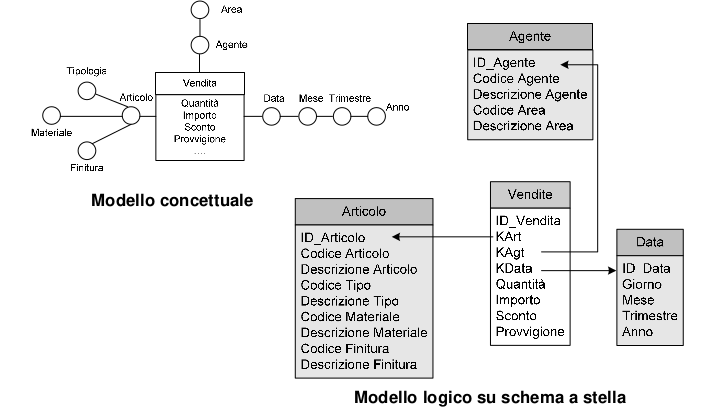
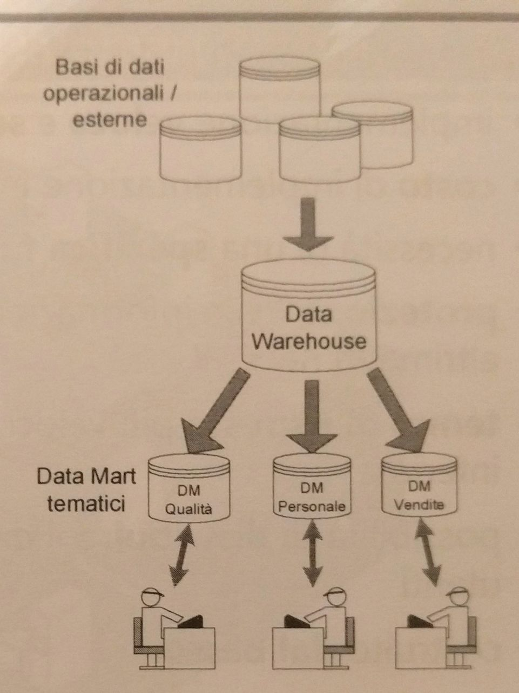
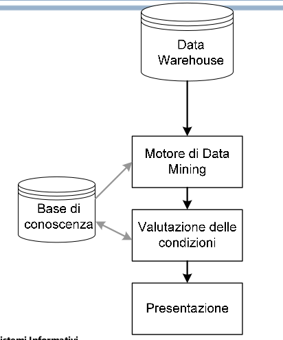

# Sistemi Informativi

## Capitolo 0
### ICT e società della conoscienza
L’idea di una **società fondata sulla conoscenza**,
basata sulla **gestione dell’informazione**, segna il
superamento dell’era industriale, fondata sui
dispositivi meccanici, che a sua volta aveva sostituito
le società agricole fondate sulla domesticazione di
piante e animali.

### ICT: trends, convergenza e conseguenze
- **Velocità**: Ogni aspetto delle attività umane e ogni istituzione opererà
e cambierà in tempo reale
- **Connettività**: Ogni cosa viene progressivamente interconnessa
elettronicamente con ogni cosa: prodotti, servizi, persone, pesi, ecc.
- **Intangibilità**: Ogni cosa diventa «intangibile» ed esce dalla sfera di
percezione fisica dell’essere umano

### Le nuove leggi della società della conoscenza
- Legge di Moore: 1965: « Le prestazioni dei processori, e il numero di transistor ad esso relativo, raddoppiano ogni 18 mesi. »
- Leggi di Sarnoff, MetCalfe, Reed
    - Valore:
        + Distribuzione solo contenuto (es. sito brochureware) ->
valore lineare.
        + Attivazione transazioni per il commercio elettronico ->
valore quadratico
        + Comunità, social network ecc -> valore esponenziale

<p align="center"></p>

<p align="center"></p>
**Hype Cycle di Gartner**

- **Scintilla Tecnologica** innesca un potenziale di innovazione tecnologia.
Le prime storie, Proof-of-concept e l’interesse dei media scatenano
pubblicità significativa. Spesso non esistono prodotti utilizzabili e la
realizzabilità commerciale non è provata.
- **Picco di aspettative gonfiate**, pubblicità anticipata produce una serie di
storie di successo, spesso accompagnata da decine di fallimenti.
Alcune aziende agiscono, molte non lo fanno
- **Ventre della disillusione** interesse svanisce quando esperimenti e
implementazioni non riescono a sfondare. I produttori della tecnologia
falliscono o escono. Gli investimenti continuano solo quando i prestatori
superstiti migliorano i loro prodotti per la soddisfazione di early adopter.
- **Risalita dell’illuminazione**: più esempi dimostrano e aiutano a
comprendere come quella tecnologia possa favorire il business. Prodotti
di seconda e terza generazione appaiono da fornitori di tecnologia.
Altre imprese finanziano progetti pilota; aziende conservatrici restano
caute
- **Altopiano della Produttività**: il mercato mainstream inizia a decollare.
Criteri per la valutazione della sostenibilità sono più chiaramente definiti.
L’ampia applicabilità di mercato della tecnologia e la sua rilevanza
chiaramente danno i loro frutti.

**Long Tail di Anderson**: la gran parte delle occorrenze è lontana dalla
parte centrale di una distribuzione di popolarità o
probabilità

**Disruption**: Indica il momento in cui una nuova tecnologia origina il
cambiamento di una determinata attività e modifica
completamente il modello di business precedente.
- presentano una serie di attributi che inizialmente non
sono valutati dai clienti esistenti;
- evolvono così rapidamente da invadere i mercati
consolidati.

## Capitolo 1 - Concetti generali sull'informatica aziendale

### Concetti di base
- **Sistema Informativo**: informazioni utilizzate, memorizzate, elaborate in un'organizzazione per perseguimento dei propri fini
- **Sistema Organizzativo**: risorse/regole d'utilizzo coordinato di tali risorse, utilizzate per il perseguimento dei propri obiettivi
- **Sistema Informatico**: parte del s.i. in cui informazioni sono raccolte, elaborate archiviate, scambiate mediante l'uso delle ICT


- **Risorsa**: tutto ciò con cui l'organizzazione opera, sia materiale che immateriale, per perseguire i soi obiettivi
- **Processo**: insieme attività (sequenze di decisioni e azioni) che l'organizzazione svolge per gestire il ciclo di vita di una risorsa o di un gruppo omogeneo di risorse

**Componenti di un Sistema Informativo**
- **Hardware**
- **Software**
- **Dati**
- **Persone**
- **Processi**

### Informatica, Informatica aziendale e Sistemi informativi aziendali
**Informatica**: Informazione + automatica
- la scienza che studia i principi di rappresentazione ed elaborazione elettronica dell'informazione
- l'insieme delle strutture tecnologiche hardware e software utilizzate per la raccolta, l'archiviazione, l'elaborazione dei dati e la produzione di informazioni.
    
**Sistema informativo**: **l'insieme delle procedure e delle infrastrutture** che definiscono e supportano il fluire delle informazioni all'interno di una **struttra organizzativa**. 
Si può definire come quel complesso di elementi interconnessi che:
- Raccolgono
- Catalogano
- Ricercano
- Elaborano
- Memorizzano
- Distribuiscono

dati nell'intento di:
- rappresentarli in modo organico
- trasformarli in informazioni utili
- supportare le attività decisionali e di controllo di un'azienda

- ITC: Information and Communication Technology
    + IT Information Technology
    + TLC Telecommunication

- **Informatica aziendale**: disciplina che **studia l'applicazione dell'informatica alle aziende** e l'influenza dell'informatica sulle diverse categorie di elementi costituenti il sistema aziendale.

<p align="center"></p>

- Esigenze di business - Marcroaree di influenza:
    + **Operativa**: supportare, guidare e facilitare i compiti esecutivi
    + **Organizzativa**: migliorare l'organizzione del lavoro, dei processi e il flusso delle informazioni.
    + **Controllo**: tenere sotto controllo gli eventi aziendali, supportando analisi quantitative e politiche di cotrollo
    + **Strategica**: permette di elaborare strategie basate sull'analisi di dati provenienti da altri sistemi
- Problemi del business:
    + *Resistenza al cambiamento*
    + *Difesa del proprio ruolo / minaccia vecchi privilegi*
    + *Scollamento tra dirigenza e figure operative*
    + *Mancanza di competenze per assorbire l'innovazione*
    + *Preferenza pe soluzioni alternative e in competizione*
    + *Incompatibilità tra soluzione e processi / relazioni aziendali*


- **Sistemi informativi aziendali**: hanno come obiettivo finale la **distribuzione di informazioni alle persone** che operano all'interno dell'azienda nel momento in cui l'informazione è necessaria.
- La costruzione è pilotata da:
    + Identificazione dei fenomeni, interni o esterni, che l'azienda ha interesse a rappresentare.
    + Dalle modalità attraverso cui rappresentare i fenomeni
    + Dalla natura delle informazioni che l'azienda si aspetta di ottenere.
- Elementi che lo compongono:
    + **Dati**: 
        * di configurazione: es. moneta d'esercizio
        * operativi: es. info sull'andamento di una lavorazione
        * di supporto: nome web server su cui è stata fatta un'azione
        * di stato: fatturato azindale
    + **Procedure**: specificano e attuano le sequenze di azioni che ermettono al sistema di aderire alla realtà
    + **Mezzi e strumenti** per il trattamento e il trasferimento delle infromazioni

### L'impatto dell'informatica nelle aziende
I sistemi infromativi sono strumenti per diffondere la conoscenza all'interno dell'azienda.
Le necessità di un'azienda si differenziano in base a diversi fattori
- **Livello di astrazione**: il grado di sintesi delle informazioni richieste.
- **Tempempesitività**: assere informati su azenti aziendali all'occorrenza
- **Livello di copertura**: l'attenzione deve essere concetrata su un'area particolare e un certo periodo di tempo.

Le informazioni all'interno di un'azienda fluisce in due diverse direzioni
- Orizzontalmente: definendo e sincronizzando i processi operativi aziendali
- Verticalmente: in flussi che riorganizzano ed elaborano i dati oprativi raccolti delle procedure, estrendone informazioni diverse per i diversi livelli

Il ruolo principale dell'informatica all'interno dei **processi classici** è quello di:
- ridurre il costo meccanizzando prodeure altamente standardizzate
- migliorare il processi rendendoli più definiti e omogenei
- aumentare la quantità la qualità dei dati raccolti

successivamente il ruolo passa ad altre aree strategiche azinedali:
- Pianificazione: i dati raccolti attraverso l'informatizzazione dei processi possono essere utilizzati per alimentare procedure di pianificazione.
- Controllo: la qualità e soprattutto l'immediata disponibilità di dati consente la definizione di procedure di controllo efficaci.

Con l'introduzione dell'informatica all'interno delle aziende essa diviene veicolo per il cambiamento: cambiamento dell'organizzazione e dei flussi, innovazione nelle modalità di trattamento dei dati e di comunicazione.
BPR (Business Process Rengineering) introduce innovazione agendo pricipalmente sui processi di business modificando le procedure azinedali.

### L'impatto macroeconomico dell'IT, la sua evoluzione storica e i cambiamenti organizzativi generati

<p align="center"></p>

Nel 2010 la spesa per l'IT è stata 1,2% del PIL in Italia

- Epoca dei mainframe: anni 60
- Epoca dei minicomputer: anni 70 (ArpaNet)
- Epoca dei PC: anni 80

Cambiamenti a livello interno alle aziende:
- Riduzione dei ruoli impiegatizi
- Riqualificazione dei ruoli: controllo porduzione
- Riduzione dei ruoli di supporto: posta elettronica, agende
- Revisione dei processi di font office: sistemi di comunicazione
- Revisione del modello organizzativo: da una struttura orientata alla funzione a una struttura orientata al processo.

## Capitolo 2 - Struttura dell'azienda e del suo sitema informativo
### Esigenza informativa
La struttura del sistema informativo aziendale determina l'insieme delle informazioni disponibili e le dinamiche dei flussi operativi dei dati. La sua articolazione deve rispondere in modo adeguato a ongi diversa esigneza informativa: devono coesistere, all'interno del sistema informativo aziendale, il dettaglio richiesto dai ruoli operativi e la sintesi necessaria ai livelli decisionali. **L'esigenza infromativa non è definibile a livello di azienda, ma è relativa al tipo di attività che ogni persona deve compiere all'interno dell'organizzazione**.

Funzione primaria del sistema infromativo è supportare **chi fa funzionare l'azienda attraverso al propria attività**

**Supporto necessario in aree diverse, con livello di astrazione che sale man mano che aumenta il livello decisionale**

L'Esigenza informativa dipende dal tipo di attività da compiere in azineda:
- i livelli operativi hanno bisogno di infiormazione dettagliata e attuale
- i livelli decisionali hanno bisogno di informazioni sintetiche

### Schema di Anthony
I livelli operativi hanno bisogno di informaizoine dettagliata e attuale; **man mano che si sale ai libelli decisionali l'informazione richiesta è sempre più sintetitca**, costituita da indicatori sull'andamento delle attività e sullo stato dell'azienda otenuti elaborando dati relativi a eventi elementari.

<p align="center"></p>


Una rappresentazione efficace della classificazione dell'esigenza informativa è la piramide di Anthony: man mano che si sale nel livello decisionale, la necessità di molte informazioni dettagliate decresce, mentre cresce l'esigenza di avere poche informazioni sintetiche di qualità che permettano l'adozione di decisioni strategiche correntte.

Il modello di Anthony, 1965, distingue tre diversi livelli, ognuno dei quali interagisce con quelli adiacenti realizzando cicli di pianificazione e controllo attraverso i quali verificare risultati e decidere azioni correttive: 
- **Direzionale strategico**: identifica gli obiettii primari dell'azienda nei confronti del mercato e della concorrenza.
- **Direzionale tattico**: si occupa dell'analisi economica, definendo le previsioni a medio termine e verificandone periodicamente l'attuazione; fornisce inoltre gli indirizzi operativi attraverso piani eseutivi, come i piani di produzione e i programmi di spiedioine;
- **Operativo**: attua i piani definiti occupandosi dello svolgimento delle attività correnti.

### Profili informativi
Ai diversi livelli corrispondo diversi profili informativi, che si differenziano 
- per la quantità di dati necessari al processo decisionale 
- per il grado di aggregazione 
- per la frequenza con cui avviene la consultazione dei dati 
- per la fonte da cui i dati provengono.

Man mano che si sale nel livello, i processi decisionali diventano sempre meno standardizzabili e difficilmente rconducibili a procedure automatizzate.
A differenza dei pocessi operativi, i processi decisionali non sono facilmente strutturabili.

- **livello direzionale strategico**: competono informazioni sintetiche, diversificate e poco strutturate. es concorrenza, mercati, ipotesi sugli scenari futuri, progetti di investimento.
- **livello direzionale tattico**: competono le attività di definizione di obiettivi a breve compatibili con il piano strategico aziendale e con il controllo periodico dei rsultati ottenuti, per verificare l'effettivo raggiungimento degli obiettivi. es. controllo budget delle vendite
- **livello operativo**: si occupa dell'attuazione dei piani e dello svolgimento dell'atività concorrente. a questo livello competono la registrazione degli eventi aziendali. es. inserimento di un ordine, registrazione di un pagamento, avanzamento dei processi, registrazione di un'avvenuta lavorazione.


### Scomposizione del sistema informativo: sistemi operazionali e sistemi informazionali
Le diverse esigenze informative hanno portato nel tempo a una separazione tra sistemi informativi **orientati alle decisioni** e sistemi **orientati al supporto dell'operatività** e al controllo sistematico dele attività aziendali.

I sistemi di supporto alle decisioni, i cosiddetti *sistemi informazionali*, aiutano nella ricerca di soluzioni a problemi non (completamente) strutturati. Si pongono quindi come sistemi separati e complementari ai sistemi di supporto alle attività, chiamati *sistemi operazionali*; i primi vengono alimentati principalmente con i dati dei secondi, ma le finalità dei due sono completamente diverse, come diversa è la loro struttura.

- **sistemi informazionali: supporto alle decisioni**
- **sistemi operazionali: supporto alle attività**


**Sistemi operazionali**
**I sistemi operazionali costituiscono l'infrastruttura informatica su cui si appoggia l'attività esecutiva**. 

Le funzioni principali:
- **L'automazione delle attività procedurali**. es. redazione delle fatture, in cui calcoli vengono effettuati dal sistema
- **Il supporto alle attività aziendali**, che risultano semplificate dalla presenza, sul sistema operazionale, di informazioni aggiornate facilmente reperibili. es. conoscere la disponibilità di un articolo.
- **La raccolta di dati** che permettano ai livelli decisionali il controllo dell'attività operativa. rs. consunltazione delle lavorazioni in produzione
- **La guida per l'operatore**, che segue con procedure e flussi predefiniti e controllati, con poche possibilità di incorrere in errori. es. inserimento di un oridine con verifiche di controllo errori

Data la sua natura esecutiva, il sistema operazionale ha la tendenza a strutturare i flussi e a strandardizzare il contenuto informaivo per minimizzare la possibilità di commettere errori e, nello stesso tempo, rendere le operazioni fluide e rapide.

Azioni sui dati:
- **L'accesso interattivo in inserimento, lettura, modifica**
- **Trattamento dei dati**
- **Descrizione degli eventi**
- **Valutazione e trattamento di informazioni attuali**
- **Aggregazione per il calcolo di indicatori di stato**

Componenti fondamentali:
- **Procedure**, attraverso cui si definiscono i corretti flussi di informazione e si guidano gli operatori nella loro attività quotidiana, esecutiva o di controllo operativo
- **Base di dati**, che deve essere strutturata in modo tale da fornire buone prestazioni in relazione alla tipologia e al numero di operazioni effttuate dagli utenti.

**Sistemi informazionali**
**I processi decisionali non sono standardizzabili nè riconducibili a precedure automatizzate**, perchè sono influenzati dai modelli di realtà che le persone utilizzano per effettuare le scelte. I sistemi sistemi informazionali **devono pertanto supportare il processo decisionale** seguendo i passaggi logici del decisore e dandogli la possibilità di avere visioni diversamente organizzate dei dati.

Funzioni principali:
- **informazioni sui risultati** rispetto agli obiettivi aziendali
- **strumenti per il confronto** tra indicatori aziendali e parametri ambientali (concorrenza, domanda, ecc.)
- **strumenti che facilitino il processo decisionale**, come analisi interattive, strumetni di ricerca di correlazioni, singolarità e raggruppamenti nei dati, simulazioni condotte a partire dai dati operativi ipotizzando scenari per il futuro.

Azioni sui dati:
- **Acccesso interattivo in sola lettura**
- **L'aggregazione di dati**
- **Descrizione dei soggetti**
- **La profondità temporale**
- **La ricerca per argomento, aziché per evento**
- **L'analisi multidimensionale**: l'incrocio delle informazioni.

Componenti fondamentali:
- **Base di dati informazionale** (Data Warehouse)
- **Strumenti di analisi**
- **Procedure di alimentazione**

Il punto focale dei sistemi informazionali è la base dati, che assume il nome diverso di *data warehouse*, magazzino dei dati, a indicarne l'assoluta centralità. Il data warehouse deve essere:
- strutturato per contenere tutti i dati che possono risultare utili nel processo di analisi
- strutturato per garantire bassi tempi di attesa fra l'interrogazione e la visualizzazione dei risultati
- periodicamente aggiornato con dati coerenti, completi, corretti e attendibili
- permanente. I risultati con i stessi dati devono essere sempre uguali
- facilmente interrogabile secondo criteri variamente articolabili e percorsi liberi.

Contrariamente al sistema operazione, l'accesso ai dati è nella maggior parte dei casi in sola lettura.

### Operazionale vs Informazionale


## Capitolo 3 - Scelte organizzative
Verranno descritte alcune sclete che stanno alla base dell'organizzazione dei moderni sistemi informativi azinedali. Tali scelte riguardano
- forme di reperimento/costruzione del sistema informativo
- posizionamento della struttura che si occupa del sistema informativo all'interno dell'azienda
- le problematiche connesse all'interrompibilità del servizio fornito dal sistema informativo

### Costruzione del sistema informativo
Le scelte sono 3 ma in realtà si fà un mix delle soluzioni con preponderanza di una visione.

- **Opzione Make**: prevede la costruzione interna del proprio sistema informativo, quindi la creazione di un gruppo di lavoro interno all'azienda in grado di progettare, costruire e manutentare l'intero sistema. Solitamente scelta dalle grandi aziende
    + Costi fissi notevoli
    + Investimenti consistenti: costi sw e hw
    + Struttura che non si confronta con il mercato: la struttura di sviluppo opera come una comune software-house con un unico cliente. non c'è alcun confronto con il mercato esterno come farebbe una vera software-house.
    + Soluzioni che tendono a diventare obsolete: la struttura sarà difficilmente alla ricerca di soluzioni aggiornate.
    + Tempi di soluzione veloci per problemi banali, ma lunghe per i problemi complessi
    + Mantenimento interno del know-how
    + I modelli organizzativi possono essere mappati in maniera molto puntuale: software ad hoc
- **Opzione Buy**: prevede l'acquisto del prprio sistema informativo e quindi crea un piccolo gruppo interno di lavoro in grando di gestire l'utenza esterna e di interloquire tecnicamente con l'esterno. Scelta della piccola media impresa.
    + Comunque presenza interna ridotta: costi ridotti
    + Parziale smobilizzazione degli investimenti: non sono necessari investimeniti della struttura di sviluppo
    + Concentrazione sul core-business
    + Stretta dipendenza da una struttura esterna
    + Maggior flessibilità rispetto alla soluzione Make. Il fornitore può crescere il prodotto anche in base alle richieste di altri clienti
    + Parte del know-how aziendale che esce.
    + Mancanza di proprietà del software
    + Possibilità di interventi limitata
    + Aderenza al mercato e confronto con esso: eveluzione continua del sistema
    + Modelli organizzativi mediati
    + Difficoltà di interazione con più fornitori: moduli specifici
- **Opzione Outsource**: prevede di delegare completamente all'esterno la gestione e l'organizzazione del sistema informativo. Limitata alle grandi aziende.
    + Costi variabili ma sensibilmente alti
    + Totale smobilizzazione degli investimenti: nessun investimento in infrastruttura
    + Completo vincolo con il fornitore della soluzione
    + MAggior flessibilità
    + Fuoriuscita di tutto il know-how
    + Perdita di controllo su una variabile critica del proprio modello organizzativo: fortissima dipendenza con il fornitore, mitigabile con forme contrattuali molto stringenti
    + Possiblità di interventi diretti nulla
    + Aderenza al mercato e confronto con esso come il modello Buy
    + Modelli orgnaizzativi mediati
    
### Posizionamento del sistema informativo
Le figure professionali "informatiche" che operano all'interno dell'azienda si possono considerare macroscopicamente in 4 livelli.

- **Livello 1**: Il team informatico è composto da un **ristretto nucleo** di persone, con **competenze molto diversificate** e spesso solo parzialmente dedicate a questa funzione. Si occupano in maniera indistinta di tutti i problemi. La struttura è completamente orrizonatale, non esistono figure responsabili. I **ruoli non sono definiti**, usualmente privi di budget nel medio periodo. Visione miope dell'organizzazione.
- **Livello 2**: Si comincia a delineare una precisa organizzione del settore. E' identificata una funzione di responsabilità: il **responsabile EDP** Electronic Data Processing. Ci sono persone impegnate in **3 filoni d'azione** con professionalità distinte.
    + **L'assistenza tecnico-sistemista**: si occupa dell'infrastruttura tecnologica
    + **L'assistenza applicativa**: supporta gli utenti nella normale operatività e nell'uso delle procedure
    + Lo **sviluppo di nuove applicazioni** che si occupa di predisporre nuove procedure software e nuovi sottosistemi di gestione è sempre prensente in una logica *Make*, mentre in una logica *Buy* o *Outsource* questa funzione viene risolta fra l'EDP e l'assistenza applicativa, visto he viene demandata operativamente all'esterno e all'interno resta solo l'eventuale gestione.

<p align="center"></p>

- **Livello 3**: Viene riconosciuta una propria **Direzione** che quindi assume un ruolo strategico nei progetti d'azienda. Oltre al blocco più operativo (come capo EDP), si crea una nuova **sezione che studia l'applicazione delle nuove teconologie** nei vari ambiti dell'azienda.

<p align="center"></p>

- **Livello 4**: Rappresenta il massimo livello. **Il settore viene riconosciuto come un'entità** che svolge attività per il resto dell'azienda e quindi si introducono esplicitamente altre funzioni in staff alla Direzione, quali per esempio:
    + **segreteria**
    + **pianificazione**
    + **privacy e sicurezza**
    + **documentazione e standard**
    + **definizione e controllo dei budget e dei costi del settore**


### Interrompibilità del servizio informatico
Spesso la direzione d'azienda non ha chiara visione dei rischi e degli effetti di un'eventuale interruzione del servizio. Questa interruzione può portare in breve a una completa paralisi di qualsiasi organizzazione. 

**Problematiche legate all'hardware**
L'**hardware soffre di mortalità infantile**, tende eventualmente a guastarsi nelle primissime fasi di utilizzo, poi le pobabilità di malfunzionamenti è alquanto limitata. Più delicate sono le parti in movimento come gli hard disk, tendono ad avere maggiorni problemi, particolarmente legati all'usure delle parti in movimento. Può portare alla perdita dei dati.
Il **tempo di ripristino** è sensibile, bisogna sostituire l'unità diffettosa, ricaricare la parte di sistema o di dati necessari, riconfigurare il sistema. Queste operazioni possono richiedere anche giornate di lavoro che compormettono l'operatività dell'azienda. 
Questi problemi si combattono con due approcci
- **rindondanza**: RAID, hot-swap (disco rimovibile al volo), vale solo per i dischi
- **sistemi fout tollerant**: archittetture completamente rindondanti
    + MTBF Medium Time Between Failure

Vanno accennati anche i **backup**, in caso di necessità si deve ricorrere a copie di dati che fanno fatte frequentemente, tenute in ambienti protetti e sicuri. In caso di necessità vanno usate le dovute tecniche di disaster recovery.

**Problematiche legate al software**
Il sofware presenta sempre malfunzionamenti di qualche tipo. L'unica possibilità è **ricorrere a tecninche di ingegneria del software** che riducano le probabilità di problematiche. I malfunzionamenti software raramente bloccano l'intera attività, più spesso possono interferire con un processo o con un gruppo di attività aziendali. Per controbattere a questi problemi un'arma efficace è avere a disposizione da parte del fornitore una **struttura di supporto** che possa o correggiore l'errore o suggerire procedure alternative per gestire il processo (turn-around). Un'altra strategia potrebbe essere quella di **recuperare una vecchia versione** funzionante.

**Problematiche legate ad azioni dolose**
Queste azioni possono arrecare interruzioni del servizio, ma anche altri danni, quali per esmepio furto di denaro o di proprietà intelletuali o di informazioni riservate.
**Gran parte dei danni è causata da persnale interno** o da terzi che hanno accesso a strutture di calcolo interne. I sistemi per contrastare l'accesso dall'esterno come firewall se ben configurati e tenuti aggiornati sono sufficientemente sicuri per la gran parte delle casistiche.
Possono essere usate **tecniche per autenticare e autorizzare gli utenti** che utilizzano il sistema. Qualcosa che ho, qualcosa che so, qualcosa che sono.

## Capitolo 4 - Sistemi Operazionali
### Finalità dei sistemi operazionali
I sistemi operazionali sono sistemi informativi orientati al trattamento delle attività quotidiane. La loro principale funzione è l'elaborazione interattiva di transazioni, eventi di interesse e atti rilevanti per l'azienda che si verificano in un determinato momento. 

Le finalità di sistemi operazionali possono essere ricondote a quattro grandi categorie:

**Registrazione delle transazioni**
Comprende **tutte le operazioni elementari che rappresentano eventi** che si manifestano in un dato momento e che l'azienda ha interesse a memorizzare. es orgini cliente, prelievi da magazzino.
Possono essere:
+ semplici: un semplice date. es. movimentazione di magazzino
+ complesse: concretizzarsi in una serie più o meno ampia di registrazioni elementari, spesso correlate a documetni fisici. es. spedizione che include destinatario, lista dei prodotti, data ecc..

**Pianificazione e controllo delle operazioni** 
L'uso di sistemi informativi rende possibile l'adozione di modelli complessi di pianificazione e consente il monitoraggio continuo dello stato dei processi tramite l'analisi delle transazioni di avanzamento registrate. **Lo scostamento tra piano e consuntivi può far emergere** **eccezioni**, dare una **misura dell'efficenza aziendale** ed **evidenziare punti critici** su cui si deve concentrare l'attenzione al miglioramento. es. piano di produzione, sistemi per la previsione dei consumi e delle vendite, per la composizione del carico delle spedizioni, avanzamento delle commesse, oprazioni di manutenzione e assistenza. 

Vengono utilizzate per 
+ razionalizzare l'attività e rendere più fluida la concatenazione tra processi
+ misurare la capacità aziendale di rispettare gli obiettivi fissati
    
**Acquisizione e organizzazione della conoscenza**
Un funziona primaria dei sistemi operazionali è l'archiviazione organizzata dalla conoscenza aziendale.
Lo scopo è trattare in modo centralizzat otutte le informazioni di supporto all'attività. Basi di conoscenza organizzata sono: registrazioni di transazioni, anagrafiche di clienti, fornitori, prodotti, ecc, composizione dei listini, struttura del piano dei conti.
Le informazioni hanno le seguenti caratteristiche comuni:
- Strutturate: riconducibili a un insieme di caratteristiche predeterminate che descivono ogni elemento archiviato
- Correlate: per esempio la distinta base è correlata agli articoli, il cliente alla sua catena di agenzia, ecc.

**Elaborazione delle situazioni aziendali**
La sintesi di tutte le funzioni fin qui svolte dal sistema informativo aziendale è la possiblità  di eleborazione di indicatori dello stato corrente.
Se consideriamo il sistema informativo aziendale come un sistema dinamico, gli archivi ne rappresentano la struttura, gli eventi che scatenano le transazioni son ogli ingressi, le transazioni e le pianificazioni sono la porzione dinamica che sulla base dello stato corrente e degli input ricevuti, porta il sistema in un nuovo stato.
**L'elaborazione degli indicatori di stato è uno dei compiti fondamentali del sistema infromativo**. La conoscenza dello stato corrente permette ai decisori di agire sul sistema azienda tramite leve opportune.
Gli indicatori sono per esempio: le giacenze degli articoli nei depositi, l'elenco degli ordini inevasi, il livello di saturazione dei reparti produttivi, il fatturato corrente...

### Potenzialità informatica (intensità e attrativa)
La potenzialità informatica di un'azienda è la funzione di due amcroindicatori, uno l'*intensità informativa* relativo alla necessità di informazioni proprie dell'azienda, dipendente dal mercato in cui opera e dalla complessità della sua struttura, l'altro *l'attrativa informatica* più strettamente correlato alle caratteristiche dei processi aziendali. A questi deve aggiungersi la propensione del managment all'investimento in infrastruttura informatica e all'uso di tecnologia a supporto delle attività, paramentro che in molti casi determina il successo o l'insuccesso delle soluzioni informatiche installate.

**Intensità informativa**
Le aziende si differenziano per la natura dei prodotti che costruiscono o dei servizi che erogano. Queste differenze si riperctuotono nulla complessità dell'organizzaione aziendale e dei processi aziendali, e nella quantità più o meno eleveata di informazioni necessarie per realizzare il proprio core business.
La complessità è riconucibile al seguente insieme di paramentri:
- **Dimensione**: più è elevato il numero di persone che cooperano più è la sua complessità
- **Area geografica su cui si estende sul mercato**: aziende che operano in ambito internazionale devono trattare le differenze di normativa e di cultura presenti tra paee e paese, oltre che misurarsi con una concorrenza più ampia
- **L'appartenenza a un gruppo**: maggiore complessità di traduce nella necessità di coordinamento tra le diverse aziende
- **Il livello di diversificazione dei prodotti, dei mercati e delle tecnologie**: al crescere del livello aumentano sia il patrimonio informativo, sia la complessità di gestione della conoscenza

Aziende con elevata complessità hanno la necesstià di elaborare grandi volumi di informazioni e quindi hanno un'elevata intensità informativa. Possono ridurre la loro intensità informativa adottando soluzioni organizzative particolari, come il sovradimensionamento delle risorse per i processi e la costituzione di celle operative autonome.
Si definiscono due parametri che danno la misura della necessità informativa intrinseca di un'azienda:
- **Intensità informativa del prodotto**: ogni prodotto ha caratteristiche che rendono più o meno proficua la sua gestione mediante strumenti informatici. L'infomatica può fornire supporto alla gestione delle informazioni relative al prodotto finale: maggiore è la complessità del prodotto, più elevato è il bisogno di mantenere queste informazioni in forma articolata.
- **Intesità informativa di processo**: più il processo è articolato, più è elevata la necessità di gestire l'informazione a eso associata. Processi più complessi richiedono maggiori informazioni per gli opratori e controlli più stretti sull'avanzamento. 

L'intesità informativa aziendale, combinazione delle intensità informative di prodotto e di processo, è quindi indicatore della quantità di informazioni necessaria alla vita aziendale e dei benefici tangibili che questa può ottenere tramite l'introduzione e l'uso di sistemi informativi.

**Schema Porter-Millar**
Rappresentazione grafica dell'intensità informativa di un'azienda può essere ottenuta adottando la griglia di Porter-Millar, che classifica le aziende sulla base dell'intensità informativa (alta-bassa) dei processi e di quella dei prodotti.


**Attrattiva informatica**
L'intensità informativa non è sufficiente per determinare il vantaggio che l'uso di tecnologie informatiche può apportare. Esistono altri indicatori. I processi aziendali vengono integrati in un sistema informativo sulla base della facilità con cui possono essere automatizzati e dei vantaggi immediatamente ottenibili dall'automatizzazione. 
I parametri per valutare l'attrativa informatica di un processo sono i seguenti:
- **Proceduralità**: un processo può avere diversi gradi di strutturazione, dove con strutturazione si intende la possibilità di definire in sequenza le azioni elementari da compiere per completarlo. Se privo di zone di discrezionalità o di aleatoriertà può essere facilemente informatizzato.
- **Complessità**: è un indicatore della complessità delle azioni elementari previste dal processo. Un processo semplice è il calcolo del peso e del volume di un carico, dati i colli che lo compongono. Decidere la composizione di un carico, ottimizzandolo sulla base dei colli da spedire e del percorso del vettore, è invece un processo complesso.
- **Ripetitività**: se un processo viene reiterato senza variazioni con grande frequenza nel tempo, la sua attrativa informatica è eleveata.
- **Volume**: più elevata è la quantità di dati da elaborare, maggiore è l'attiva informatica del processo.

i processi che hanno attrattiva informatica maggiore sono quindi processi completamente strutturati, con elevati volumi, con elevata ripetitività e poco complessi.


### Catena del valore di Porter
Da alcuni anni lo schema fornito dalla catena del valore di Porter viene considerato una buona base di partenza per rappresentazione dela struttura azinedale e per la segmentazione di bisogni informativi aziendali. Questa segmentazione ci consente di definire l'insieme, o portafoglio, delle possibili applicazioni dei sistemi informativi aziendali.

Questo schema è stato formalizzato per esaminare le attività aziendali e rilevare le aree di vantaggio competitivo attuale e potenziale.
E' basato sulla rappresentazione schematica delle classi di attività che ogni azinda sviluppa per rendere competitivo il suo prodotto o servizio.

Lo schema riconduce tutte le attività aziendali a nove classi principali, ulteriormente accorpate in due categorie: le attività primarie e quelle di supporto.

- **Attività primarie** (market driven): processi prpri del core business dell'azienda
    + **Logistica in entrata**: tutti i processi legati al trattamento del materiale in ingresso
    + **Attività operative**: sono i porcessi fondamentali dell'azienda. es. processi produttivi, processi di acquisizione di un ordine
    + **Logistica in uscita**: tutti i processi legati al trattamento del materiale in uscita
    + **Marketing e vendite**: processi legati alla presenza dell'azienda sul mercato e quelli che portano ad acquisire ordini
    + **Servizi postvendita**: attività che forniscono un servizio al cliente
- **Attività secondarie** o di supporto: tutti i processi a sostegno delle attività primarie
    + **Approvvigionamenti**: processi legati all'acquisto delle risorse impiegate nei processi primari es. certificazione fonitori, approvvigioonamento, monitoraggio del servizio reso dai fornitori
    + **Gestione risorse umane**: processi legati al trattamento del personale
    + **Sviluppo delle tecnologie**: processi legati all'innovazione dei processi primari operativi es. progettazione, collaudo, ingegnerizzzione del processo produttivo
    + **Infrastrutture**: altri processi generali dell'azienda, es. contabilità, tesoreria, organizzazione, sviluppo e manutenzione dell'infrastruttura logistico/informatica, pianificazione strategica e tutti servizi generali.


### Portafoglio istituzionale e operativo
L'insieme delle applicazini dei sistemi informativi operazionali all'azienda può essere ripartito, sulla base dello schema di Porter, in portafoglio istituzionale e portafoglio operativo

**Portafoglio istituzionale**
Contiene le applicazioni informatiche realizzate a sostegno delle attività che nello schema sono classificate come secondarie. 
Una buona parte di queste attività presenta un'elevata attrattiva informatica, perchè regolata a norma di legge, o comunque soggetta a forte prceduralità, ripetitività e caratterizzata da semplicità di elaborazione. Altra attività, com ela gestion delle risorse, dell'infrastruttura e delle finanze, sebbene non soggette a norme di legge o non particolamente semplici, sono relativamente omogenee al variare dell'azienda e non risentono della natura del prodotto o del servizio fornito. La loro informatizzazione risulta semplificata dalla preenza sul meracato di numerose soluzioni standardizzate.

```
Infrastrutture
    Contabilità
        Contabilità ordinaria
        Contabilità IVA
        Beni ammortizzabili
        compensi a terzi
    Finanziaria
        Scadenzario clienti/fornitori
        Rapporti con le banche
    Previsioni e controllo
        Budget
        Contabilità analitica
        Controllo di gensione
Gestione risorse
    Personale
        Retribuzioni
        Rilevamento presenze
        Piani di formazione
```

**Portafoglio operativo**
Il portafoglio operativo è composto dalle applicazioni informatiche legate ai processi primari. Qui assistamo a precssi di verticalizzazione del software, con elevata specilizzazione settiorale delle soluzioni proposte. Il nostro interesse verte principalmente alle PMI.
Le applicazioni infromatiche a support delle attività primarie sono molte ed estremamente articolate: la catena del valore delle industrie manifatturiere è solitamente molto ampia, copre attività di porgettazione e ingegnerizzazione, làintero ciclo gestinale, dall'acquisizione dell'ordine alla spedizione, passando per approvigionamento, fabbricazione, distrbuzione e si estende anche ai servizi postvendita, strategici per alcune tipologie di azienda. 
Oltre all'estensione, il portafoglio operativo rispecchia ance lamodalitaà con cui opera il processo produttivo: troviamo aziende che producono su commessa artocoli personalizzati per il cliente e altre che producono lotti di articoli di elevata standardizzazione;
Il portafoglio operativo di un'azienda dipende quindi dall'attrattiva informatica che ognuno dei processi ha nell'ambito aziendale; a parità di processi informatizzati, le procedure adottate da aziende operanti in settori merceologici diversi possono variare, rispecchiando le pculirità dei prodotti. 

```
Logica in entrata
    Programmaizone acquisiti
    Ordini fornitore
    Ricezione merce
    Controllo qualità

Attività operative
    Analisi dei fabbisogni
    Programmazione produzione
    Avanzamento lavorazioni interne
    Avanzamento lavorazioni esterne
    Magazzino

Logistica in uscita
    Programmazione spedizioni
    Documenti di trasporto

Marketing e vendite
    Programmazione vendite
    Listini di vendita e condizioni commerciali
    Ordini cliente

Servizi postvendita
    Assistenza clienti
```


## Capitolo 5 - Il sistema ERP e le sue scomposizioni per sistemi di base
Fino ai primi anni 90 i sistemi informativi nelle grandi aziende erano articolati in isole informatiche autonome. Con questi sistema rifletteva bene:
- lo sviluppo incrementale del sistema informativo aziendale: di norma tende a procedere per aree
- relativa rigidità delle organizzazioni aziendali
- la grande specializzazione dei produttori software

ma questi sistemi possono portare a problemi consistenti nell'ottica complessiva dell'azienda. I principali punti deboli sono:
- eterogeneità dei sistemi: diversi fornitori con differenti convenzioni
- separazione: notevole sforzo nell'integrazione dei sistemi
- autonomia dei sottosistemi: molte informazioni devo essere salvate più volte su archivi diversi
- etererogeneità e separazione rendono difficile la visione d'insieme

La complessità dei ssitemi informativi a *isole* ha favorito la rapida diffusione dei sistemi ERP, sistemi informativi operazionali nativamente integrati. 
**ERP: Enterprise Resource Planning, pianificazione delle risorse dell'azienda.**
La copertura funzionale dei sistemi ERP si estende dalla definizione della base di dati comune alla realizzazione dei processi gestionali aziendali, lavora soprattutto su:
- attivitò routinarie e gestionali: l'avanzamento della produzione è parte di un sistema ERP, mentre non lo è la progettazione;
- attività interne all'azienda: eventi che hanno ripercussione sulla struttura interna, mentre quelli esterni sono delegate ad altri sistemi.

I sistemi **ERP sono composti da sottosistemi nativamente integrati**: sviluppati da un'unica software house, condividono una base di dati comune e le procedure sono progettate per inteagire e cooperare. Oltre a questa funzione unificante, gli ERP si propongono anche come sistemi informativi flessibili, in grado di assecondare l'azienda nei suoi porcessi di evoluzione e di crescita. 

Uno dei grandi problemi dei primi sistemi gestionali è stata l'elevata rigidità che si manifestava:
- nei confronti dell'organizzazione aziendale: congelavano l'organizzazione aziendale corente
- nei confronti della piattaforma tecnologica: una volta installato il sistema, cambiare piattaforma hardware o sistema operativo era impossibile se non prendendo in considerazione anche una radicale revisione delle procedure gestionali.

I moderni ERP sono sviluppati come sistemi altamente configurabili, svincolati il più possibile dall'organizzazione aziendale

<p align="center"></p>

La flessibilità è garantita anche dal fatto che questi sono solitamente articolati in moduli indipendenti, ognno dei quali copre uno specifico ambito aziendale. L'organizzazione può cosi acquistare a ttivare i vari moduli separataemente.

Per l'attivazione di un sistema ERP in azienda richiede un impegno che comporta un periodo di avviamento durante il quale vengono analizzati, e se necessario ridefinit, i porcessi aziendali che il sistema deve sviluppare. Segue l'effettiva parametrizzazione e configurazione del sistema.

L'introduzione di un sistema EPR può avere un elevato impatto a livello culturale e organizzativo: aziende possono incontrare grandi difficoltà o addirittura rinunciare a introdure un'innovazione tecnologica. Per venire in contro a queste aziende molti fornitori propongono soluzioni standardizzate per particolari settori merceologici, con schemi di processi aziendali preconfigurati adattabili in breve tempo alla singola azienda.

**Ambiti applicativi**
Oltre ad una macrodifferenziazione, all'interno di uno stesso abito le soluzini ERP per i porcessi primari possono essere specializzate o verticalizzate. 

Un sistema ERP è comunemente somposto in sistemi di base che sono:
- **Amministrazione**: procedure ben definite e articolate. Regolano ile procedure di contabilità generale. Sottoinsiemi
    + Contabilità finanziaria
    + Compensi a terzi
    + Cespiti: beni ammortizzabili
    + Contabilità analitica
    + Budget
    + Controlle di gestione

<p align="center"></p>

- **Logistica**: si occupa del trattamnto dei materiali: la loro definizione, la loro movimentazione all'interno dell'azienda, l'analisi dei costi e delle valorizzazione a essi riconducibili.
    + Defnizione dell'anagrafica degli articoli
    + Definizione del layout aziendale
    + Movimentazione
    + Valutazione dei costi dell'articolo
    + Valutazioni inventariali

- **Vendite**: procedure del flusso attivo costruiscono la catena di processi che permette all'azienda di interagire con il cliente: coprono attività che vanno dalla presentazione dell'offerta alla fatturaione, passando per l'acquisizione dell'ordine e la sua evasione con la consegna al cliente.
    + Definizione delle condizioni commerciali: prezzo, sconto, agente
    + Processi di gestione dell'ordine cliente:
        * Ricezione
        * Elaborazione
        * Evasione
        * Analisi

- **Acquisti**: procedure del flusso passivo costruiscono la catena di processi che permette all'azienda l'interazione con i propri **fornitori** per l'approvigionamento di materiali o per la richiesta di lavorazioni o servizi esterni.
    + Deinizione delle condizioni commerciali
    + Procesi di gestione dell'ordine fornitore
        * Raccolta delle richieste
        * Emissione dell'ordine fornitore
        * Evasione

- **Produzione**: uno dei sottosistemi più articolati, fortemente dipendente dal settore merceologico. Aree in comune
    + Definizione dei dati tecnici
        * Descrizione della struttura di prodotto
        * Descrizione delle risorse utilizzate
        * Descrizione del processo produttivo
    + Pianificazione della produzione
        * Richieste di produzione
        * Disponibiltà di magazzino
        * Disponibilità di risorse interne ed esterne

## Capitoli 7-11
TODO

## Capitolo 12 - Sistemi informazionali

### Presupposti per l'analisi dei dati
I dati incorporano anche **conoscenza aziendale** consolidata negli anni e trsformare questo *know-how* in sistem moderni risulta molto difficile.
In assenza di sistemi di analisi, i servizi ICT sviluppano programmi apposti per estrarre dati o report, con:
- costi di sviluppo enormi
- manutenzione dei programmi difficoltosa
- frequenza di utilizzo scarsa (una volta o poco più)
L'avvento dei PC ha accelerato il "prurito" degli utenti di avere software di analisi facili da usare.

**DSS** Decision Support Systems: Tecnologia che suporta la dirigenza aziendale nel prendere decisioni tattico-strategiche in modo migliore e più veloce.

<p align="center"></p>
*ROT*: redundant, outdated, trivial information

**Sistemi di business intelligence**
costituiscono la tecnologia che **supporta la dirigenza aziendale** nel **prendere decisioni** operative, tattiche, strategiche in modo efficace e veloce medianti particolari tipologie di elaborazione dette "analitiche" che usano in maniera integrata i dati dell'organizzazione combinati con eventuali dati esterni.

Problemi con il data managment: Qualità vs Quantità
- Garbage in, Garbage out
    + il volume dei dati aumenta in modo esponenziale
    + i dati devono essere conservati per molto temp
    + nuovi dati vengono aggiunti rapidamente
    + sono porzion di dati sono rilevanti per le decisioni
    + dati raccoldi da persone diverse da fonti diverse
    + sono necessari anche dati esterni per prendere decisioni
    + Sicurezza dei dati, privac, qualità, integrità
    + requisiti legali

**Tipi di dati aziendali**
- Dati critici aziendali
    + dati considerati vitali per il successo operativo della società
    + da gestire e proteggere proattivamente in real-time da parte di specialisti con specifiche responsabilità assegnato dal CIO
- Dati ROT 
    + mantenerne sempre il livello minimo, eliminati periodicamente
- Dati oscuri
    + dati da cui il valore ancora non è stato chiaramente indentificato
    + includono dati scritici a livello aziendale, dati ROT o più importanti, tutti i dati illegali o non conformi che creano un rischio invisibile nel sistema IT aziendale. 

Gli **obiettivi** dell'analisi di dati e dei sistemi informazionali
- Sfruttare il partimonio dei dati operazionali per l'estrazione di informazioni utili nel processo decisionale
- Superare i limiti dei primi strumetni di DSS
    + Reporting
    + Fogli di calcolo
- Fornire strumetni per trasformare i dati grezzi in informazione e/o conoscenza aziendale di qualità a supporto:
    + attività operative
    + attività decisionali
- basi per il data management
    + profilatura
    + gestione
    + integrazione
    + miglioramento

### Sitemi OLTP e OLAP
**OLTP** OnLine Transaction Processing: Ambiente che facilita la raccolta e l'elaborazione transazionale dei dati
- tradizionalmente basatao su elaborazione di transazioni, che realizzano i processi operativi dell'organizzazione
    + operazioni predefinite, brevi e relativamente semplici
    + ogni operazione coinvolge "pochi" dato
    + dati di dettaglio, aggioranti
    + propriertà "ACID": atomicità, correttezza, isolamento, durabilità. sono essenziali

**OLAP** OnLine Analytical Processing: ambiente che facilita l'analisi dei dati
- Dati di partenza
    + basati su modello intuitivo per l'utente ad efficiente per l'anlisi
    + provenienza: db operazionale, db specialistici, fonti esterne
    + aggiornamento solo in append
- Strumenti di analisi dei dati
    + reporting
    + analisi interattiva
    + data mining

**Caratteristiche dei sistemi informazionali**
- Finalità
    + fornire il substrato informativo per la conoscenza dell'azienda
    + descrivere il passato, aiutare ad indentificare i problemi e le loro cause
    + suggerire i cambiamenti da apportare, fornire anticipazioni su scenari futuri
- Struttura: dati articolati intorno ad entità di cui si vuol conoscere l'apporto alla vita aziendale
- Utenza: decisori, manager con visione e conoscenza ampia dell'azienda

**Terminologia**
- Data Warehousing: strumenti e tecninche di definizione, costruzione, mantenimento del data warehouse
- Decision Support System: sistemi informatici usati nel processo decisionale com esupporto all'estrazione delle informazioni da basi di dati organizzate
- Data Mining: strumenti e tecniche per l'estrazione dei dati di informazioni "nascoste"
- Business Intelligence: attività di estrazione di informazione dai dati di business generati dai processi operatvii aziendali
- Knowledge Managment: trattamento informatizzato della conoscenza aziendale in senso ampio (include sorgenti dati struturate, semi-strutturate, non struttrate)

**OLTP vs OLAP**
<p align="center"></p>

**OLTP vs OLAP persistenza**
<p align="center"></p>

**Tecniche di progettazione di soluzioni OLAP**
Sono vari gli approcci per progettare e modellare soluzioni adatta per il mondo anlitico:
- ER modeling
- dimensional modeling

La soluzione più ovvia passa per il mondo relazionale ER e al sua implementazione nelgi RDBMS, ma questo mondo non si relva adatto, anzi spesso controproducente creando problemi concettuali sostanziali che differenziano il modello relazionale da modello multidimenisonale. Le soluzioni:
- applicazioni a forte contenuto multimediale -> BLOBa
- applicazioni con caratteristiche orientate agli OODBMS
- applicazioni Column-oriented DB o NOSQL: es. DMS
- reasoning, machine learning, rappresentazione a grafo, semantica...
- applicazioni riguardanti l'analisi dei dati on-line 

### RDMB, mondo analitico e performance
**TCP** Transaction Processing Preformance Council: organismo internazionale che disegna benchmark standard e ne omologa i risultati. O benchmark del TPC sono ritenuti i più importanti e significativi per la valutazione delle prestanzioni dei sistemi che ospitano DBMS.

I DBMS relazioni e i tools di front-end relativi presentano molte limitazioni quando vengono usati in attività di analisi on-line:
- **gestione inefficiente delle relazioni multi-dimensionali**
- **il problema delle normalizzazioni**
- **possibilità di operazioni analitiche molto limitate**
- **modalità di consolidamento dei dati poco efficiente**

**Gestione inefficiente delle relazioni multi-dimensionali**
**Le strutture bidimensionali (tabelle/relazioni) non sono adatte a maneggiare strutture multidimensionali**, i dati vengono memorizzati in tabelle bidimensionali relazionate tra loro, appiattendo così la potenziale multimensionalità di una vista. Collegare schemi bidimensiali per creare un modello MD è complesso, rischioso e richiede molte risorse.
L'utente finale percepisce confusione con l'uso di SQL e l'uso di join multiple causano performance pessime.

Una soluzione potrebbe essere quella di creare DB denormalizzati per DSS ma questo crea una serie di svantaggi come calo di performance e quindi un aumentare dei tempi di risposta.
L'approccio brute force con l'uso di Parallel Query Processing, potrebbe migliorare la situazione, ma è adatta solo a certi tipi di query e richiede l'uso di hw e sw molto costoso.

L'uso di database normalizzati invece porta vantaggi all'integrità dei dati ma lavora pesantemente contro la data legibility di un ambiente DSS. I svantaggi sono: 
- Molte tabelle con molte relazioni
- uno schema concettuale complesso (anche se tecnicamente perfetto)
- chiavi esterne da conoscere e interpretare
- percorsi tra tabelle non direttamente connesse
- naming conventions criptiche

oltretutto l'uso di questa tecnica rende il lavoro dell'analista OLAP più difficile dato che non ha le base tecniche per comprendere la struttura. 

Requisiti ideali di leggibilità per un DSS sono:
- chiarezza schema DW
- dati leggibili (invece che creati/gestiti dai DBA e personale IT)
- dati puliti
- dati navigabili dagli analisti 
- consistenza tra presentazione dei dati e business model dell'utente
- semplificazione della query a causa dei metadati

### Il modello multidimensionale e le operazioni principali
I sistemi informazionali si basano su una struttura dei dati particolarmente adatta all'analisi: **la struttura multidimensionale che è intuitiva, facilmente interpretabile dall'utente, e partcolarmente efficiente nelle ricerche** e nelle operazioni di aggregazione di disaggregazione dei dati. Il principio su cui si fonda questa modellazione è che **il processo di analisi** non **si articola** intorno alle attività operative, ma **intorno a temi descritti da soggetti e da relazioni quantificabili tra i soggetti**.

esempi:
- le abitudini d'acquisto dei clienti (il soggetto è il cliente)
- i margini di redditività degli articoli (il soggetto è l'articolo)
- l'efficienza della catena di distribuzione per linee di prodotto (i soggetti sono gli agenti e gli articoli)

L'analisi viene effettuata valutando in chemisura il soggetto partecipa a eventi trattati dall'azienda. Uno stesso evento può quindi essere analizzato mettendolo in relazione con diversi soggetti.

Da questa visione nasce spontaneamente la modellazione dello spazio delle informazioni dei sistemi di supporto alle decisioni con matrici multidimensionali. **In cui la misura di ogni evento è descritta da un insieme di coordinate ognuna delle quali rappresenta un soggetto di interesse** per le analisi d condurre su quell'eveneto. Esempio, se l'evento è la vendita, possibili dimensioni di analisi sono l'articolo, il cliente, la daa in cui la vendita è avvenua e l'agente che ha promosso la vendita.

Nei sistemi informazionali il modello standard de facto per la rappresentazione dei dati è l'ipercubo, una matrice multidimensionale che permette di memorizzare e di estrarre facilmente i dati relativi a una classe di eventi.
- **Fatto elementare**: l'elemento ottenuto specificando un valore per ogni possibile coordinata
- **Misure**: valori numerici che quantificano il fatto elementare
- **Dimensioni**: coordinate di ciascun elemento che costituiscono l'analisi dei fatti.

Esempio:
In un'analisi economica:
- Fatto: vendita di un prodotto
- Misure: quantità e l'importo della vendita
- Dimensioni: cliente che ha acquistato il prodotto, l'articolo venduto e la data di vendita

con un modello così costituito possiamo rispondere a domande tipo:
- quanti prodotti di un certo tipo ho venduto in un certo periodo?
- quali sono i clienti che mi portano il maggior fatturato?
- quali sono gli articoli che mi portano il maggior fatturato?
- quali sono i principali acquirenti di un certo articolo?

<p align="center"></p>

**Operazioni sui dati multidimensionali**
- **Drill down**: disggrega i dati
    + dettaglia i dati scendendo lungo la gerarchia
    + dettaglia i dati aggiungendo una dimensione di analisi
- **Roll up**: aggrega i dati
    + sintetizza i dati percorrendo le gerarchie nella direzione di maggior aggregazione
    + sintetizza i dati eliminando una delle dimensioni di analisi
- **Slice & Dice**: seleziona e proietta
    + Slice: fissa il valore di una delle dimensioni base per analizzare la prozione di dati filtrati così ottenuta
    + Dice: Filtra i fatti elementari considerati nell'analisi fissando valori per coordinate dimensionali di qualisasi livello
- **Pivot**: riorienta il cubo
    + Inverte la relazione tra le dimensioni, realizzando una rotazione del cubo nell'analisi
    + Particolarmente utile nell'analisi di dati presentati in forma tabellare


### Caratteristiche e modelli logici OLAP
- **ROLAP**: la struttura intrinsecamente multidimensionale dei fatti viene realizzata completamente su database relazioni. Gli strumenti di interrograzione agiscono tramite query SQL standard, con opportune funzioni di aggregazione.
    + Vantaggi:
        * minima occupazione di spazio
        * elevata conoscenza degli strumenti relazioni da parte degli operatori
    + Svantaggi:
        * esecuzione di query poco efficiente
        * le soluzioni per il miglioramento della velocità di risposta (denormalizzazione, materializzazione delle viste) implicano un aumento della complessità e dell'occupazione di spazio
- **MOLAP**: memorizza i dati usando strutture intrinsecamente multidimensionali: i fati vengon ofisicamente memorizzati in vettori e l'accesso è di tipo posizionale. Il sistema alloca una cella per ogni possibile combinazione dei valori delle dimensioni e l'accesso a un fatto avviene in modo diretto, sulla base delle coordinate fornite. Le interrogazioni sono ottimizzate tramite strumenti di query proprietari
    + Vantaggi:
        * elevata efficienza nell'esecuzione delle query complesse
        * stretta adereza al modello concettuale
    + Svantaggi:
        * elevata occupazione di spazio (viene allocato lo spazio per ogni possibile ennupla dimensionale)
        * mancanza di standard, sia di rappresentazione dei dati che di interrogazione
        * scarsa familiarità con il modello da parte degli operatori
- **HOLAP**: soluzione intermedia che combina i vantaggi di MOLAP e ROLAP.
    + Data warehouse: realizzato su base relazionale
        * semplicità di sviluppo e di manutenzione delle procedure di popolamento dei fatti
        * scalabilità del sistema
    + Data mart: realizzati su base multidimensionale
        * efficienza nelle interrogazioni
        * dimensioni contenute

### Gli schemi multidimensionali: caratteristiche e tipi
- Fatti: evento che accade nell'ambito dell'attività e che si ha interesse a misuarare (es. vendire, i reclami, le spedizioni)
    + Caratteristiche
        * dimensioni che lo collocano nel tempo e nello spazio aziendale
        * misure che lo quantificano
        * informazioni descrittive
    + Identificazione univoca del fatto e delle misure tramite l'ennupla di coordinate:
        * fatto: (dimensione1, ... dimensioneN)
        * misura: (dimensione1, ... dimensioneN).Misura
- Misure: caratteristica numerica del fatto che ne descrive aspetti quantitativi rilevanti per l'analisi
    + ogni fatto può avere più misure
    + le misure possono essere
        * effettive, memorizzate sulla base di dati
        * calcolate run-time utilizzando i valori delle misure effettive
        * implicite, indicano la presenza (o l'assenza) di un fatto
- Aggregabilità: possibilità di usare un operatore di aggregazione su una misura (quindi su tutte le dimensioni) o su una specifica coppia (misura, dimensione)
- Additività: possibilità di usare l'operatore di aggregazione "Somma" su una misura (quindi su tutte le dimensioni) o su una specifica coppia (misura, dimensione)
- Gerarchie: insieme di attributi (attributi dimensionali) collegati gerarchicamente ad una dimensione
    + sono usati per aggregare i fatti elementari
    + sono determinati univocamente dal valore della dimensione
    + rappresentano classificazioni della dimensione
    + l'analisi dei fatti di un cubo può essere condotta attraverso viste che utilizzano attributi dimensionali

**Schemi multidimensionali su basi di dati relazionali**
**Schema a stella**
stile più semplice di schema per data warehouse. La struttura di base consiste in una tabella di fatti che referenzia un numero (da due in su) di tabelle di dimensioni.

Questo tipo di schema viene solitamente utilizzato per la rappresentazione di data mart, ovvero di un sottoinsieme di dati aziendali o dipartimentali con uno specifico e ben definito ambito di analisi.

Esso è formato da:
- Tabella dei fatti (fact table)
    + una tabella per ogni fatto, sia co i dettagli e con dati di sintesi
    + un campo per ogni misura ed una chiave esterna per ogni dimensione di base
    + la primary key ha una sola colonna per dimensione
    + contiene come attriuti la chiave di ciascuna dimensione
- Tabelle delle dimensioni
    + ha una sola chiave
    + ogni dimensione è una singola tabella, altamente denormalizzata
    + un campo per ongi attributo dimensionale della gerarchia che ha radice nella dimensione rappresentata (denormalizzaizione completa)

I collegamenti tra dimensioni e fatti avvengono tramite chiavi esterne

<p align="center"></p>

Di fatto, un star chema se implementato in un DBMS è rappresentato da un modello relazionale con una relazione tra tabella di dimensione e fact table. Un elevato numero di dimensioni complica la gestione dei fatti e l'analisi, quindi è sconsigliato.
- vantaggi: 
    + facile da comprendere
    + mapping intuitivo tra le entità di business
    + gerarchie di facile definizione
    + riduzione di join fisico
    + mautenzione ridotta
    + metadati molto semplici
- svantaggi: i dati riepilogati nella tabella di fatto presentano prestazioni inferiori per i livelli di repilogo, mentre la dimensione enorme rappresenta un problema

<p align="center"></p>

particolarità:
- nella dimensione del tempo sono presenti dati derivati e rindondanze
- le rindondanze servono per facilitare le operazioni di analisi dei dati
- i fatti sono in forma normale di boyce-codd in quanto ogni attributo nonchiave dipende funzionalmente dalla sua unica chiave
- le dimensioni sono in genere relazioni non normalizzate

**Schema a fiocco di neve**
E' uno schema di database per data warehouse che può essere visto come una estensione dello Schema a stella.

<p align="center"></p>

La struttura di base consiste in una tabella dei fatti, al centro, che referenzia un numero (da due in su) di tabelle di dimensioni (dimension tables) che, a differenza dello schema a stella, hanno ramificazioni con altre tabelle normalizzate, anche su più livelli. Il nome attribuito a questo tipo di schema è legato proprio alla rappresentazione grafica di questi legami fra le tabelle che ricorda, appunto, quella di un fiocco di neve. 

I benefici di questo tipo di schema, rispetto allo schema a stella, sono quelli tipicamente contemplati nella normalizzazione dei database:
- azzeramento della ridondanza dei dati
- semplificazione dell'aggiornamento dei dati (conseguenza del primo punto)
- minore occupazione di spazio per la conservazione dei dati
- velocità di accesso alle informazioni

Di contro, tuttavia, questo aumento del numero di tabelle rende necessaria la scrittura di query più complesse (con più join) per la ricerca delle informazioni. Questo problema, in realtà, viene spesso superato dalla creazione di viste (View) che riportano la struttura della gerarchia di tabelle di una dimensione di analisi a quella che avrebbe avuto in uno schema a stella.

**Schema a costellazione**
Schema che vede le tabelle dimensionali condivise da più tabelle dei fatti. Risulta quindi un approccio da seguire quando più fatti coinvolgono gli stessi soggetti.

<p align="center"></p>


**Summary**
Qualcosa lo schema sia complesso (specialmente il constellation schema), il banchmarking delle prestazioni è essenziale per determinare quale sia il design migliore.
- Schema snowflake:
    + più facile mantenere tabelle di dimensione quando le tabelle di dimensioni sono molto grandi (ridurre lo spazio totale)
    + non è generalmente raccomandato in un ambiente di data warehouse
- Schema a stella:
    + più efficace per la visualizzazione di cubi di dati (meno join): può influenzare le prestazioni

## Capitolo 13 - DataWarehouse e Datamart
**Datawarehouse**: L'insieme delle strutture dati e dei tool necessari per ottenere, a partire dai dati operazionali utilizzati e creati dal sistema informativo aziendale, informazioni che aiutino i manager nella valutazione tecnico-economica dell'andamento aziendale

**Non è un programma ma un porcesso** che serve ad estrarre informazioni utili al processo decisionale a partire:
- dai dati operazionali
- da fonti dati esterne

La costruzione di DW è un processo incrementale che non comporta l'inserimento di nuove informazioni bensì la riorganizzazione di quelle esistenti e implica l'esistenza di un sistema informativo.
Si basa su principi spesso in contrasto con quelli utilizzati per i convenzionali sistemi informativi.

Un processo di DW è un complesso di attività che consente di trasformare dati operazionali in dati a supporto di processi decisionali.
I requisiti di un processo di DW sono:
- Accessibilità
- Integrazione
- Flessibilità
- Sintesi
- Rappresentazione multidimensionale
- Correttezza
- Compatezza

La persistenza dei dati è quindi:
- **subject oriented**:
    + orientato alle aree di interesse per l'analisi aziendali, create nel modello dei dati sottostante. es. dirigente aziendale
- **integrato**: aziendale e non dipartimentale
    + quando i dati sono messi nel DW, il tutto deve essere integrato e convertito, riconciliando le eterogeneità delle diverse rappresentazioni
        * nome
        * struttura
        * codifica
        * rappresentazione multipla
- **usualmente aggregata**: al fine si effettura stime e valutazioni
- **non volatile**:
    + i dati del DW sono caricati e acceduti: l'aggiornamento non avviene nell'ambiente DW
- **temporalmente corretto**:
    + la struttura del DW contiene sempre un asse temporale
    + i dati sono una serie sofisticata di snapshots, presi a determinati istanti periodici della vita aziendale
- **separato dal mondo OLTP**, per diversi motivi
    + non esiste un'unica base di dati operazionale che contiene tutti i dati di interesse
    + la base di dati deve essere integrata
    + non è tecnincamente possibile fare l'integrazione in linea
    + i dati di interesse sarebbero comunque diversi poiché devono essere mantenuti dati storici e aggregati
    + l'analisi dei dati richiede per i dati organizzazioni speciali e metodi di accesso specifici
    + degrado generale delle prestazioni senza la separazione

<p align="center"></p>

I solitamente nalla data warehouse vengono effettuate le **operazioni di accesso e interrogazione durante il giorno** e le **ore notture vengono effettuate le operazioni di caricamento e aggiornamento**.

In base all'obiettivo si usano diverse tecniche di progettazione
- Obiettivo: query/reporting
    + Tecnica di progettazione: ER
- Obiettivo: analisi multidimensionale
    + Tecnica di progettazione: modello dimensionale (data cube)
- Obiettivo: data mining
    + Tecnica di progettazione: discovery analysis 

**Data Mart**
E' un sottoinsieme (in replica) del datawarehouse contente l'insieme delle informazioni rilevanti per un particolare problema.

E' un data warehouse tematico, derivato dal data warehouse aziendale
- comprende i soli fatti che riguardano una certa area d'indagine
- è un estensione temporale ridotta
- ha una granualirità minore nei fatti rappresentati

<p align="center"></p>

Le caratteristiche di un Data Mart sono:
- implementazione veloce e semplice
- costo di implementazione inferiore
- necessità di una specifica funzionale
- protezione delle informazioni sensibili memorizzate altrimenti nel DW
- tempi di risposta più veloci dovuti ad un volume di dati inferiore
- possibiltà di distribuire il data mart alle organizzazioni degli utenti
- costruito dal basso

Le motivazioni per un Data Mart sono:
- non appena il datawarehouse cresce, la motivazione per creare i data mart cresce
- al crescere del data warehouse
    + la competizione per entrare nel DW diventa critica
    + sempre più elaborazione DSS viene fatta nel DW e quindi le risorse divantno limitate e in competizione
    + diventa difficle customizzare i dati in un DW esteso
    + il costo di effettuare elaborazioni nel DW cresce al crescere del volume dei dati
- il reparto può customizzare il proprio DM mano a mano che i dati affluiscono nel DW senza essere influenzato da altri
- l'ammontare di dati storici necessari è funzione del reparto non dell'azienda, quindi sono necessari molti meno dati
- le elaborazioni possono essere fatte dal reparto senza impatti sull'utilizzo delle risorse del sistema
- il reparto può usare software customizzato sulle proprie esigenze senza condizionare o essere condizionato dal resto dell'azienda
- il costo unitario di elaborazione e di momorizzazione è significativamente inferiore al rispettivo costo della macchina per il DW

In generale, un DW è troppo difficile, troppo costoso, troppo impolitico, richiede tempi di sviluppo troppo lunghi. DM è specifico, limitato, contestuale, orientato all'utente e focalizzato

**Fasi di costruzione** di un Data Mart:
- **Analisi delle sorgenti**
    + descrizione dei dati disponibili
    + verifica della compatibilità con i requisiti dell'utente
    + creazione schema concettuale unico e uniforme
- **Progettazione concettuale** degli schemi di fatto
    + uso di schemi a stella o a fiocco di neve, costruzione di viste materializzate o di ipercubi ad alto livello di aggregazione
- **Progettazione dell'alimentazione**
    + definizione delle procedure di popolamento del fata warehouse a partire dalle sorgenti

Ovviamente i prodotti creati devono sfruttare il web per offrire accesso ai dati sempre e ovunque

### Architetture e modelli di DW
Le caratteristiche di un'architettura per il data warehousing sono:
- Sparazione
- Scalabilità
- Estendibiltà
- Sicurezza
- Amministrabilità

Il sistema di data warehousing è costituito da basi di dati poste a livelli distinti per finalità, struttura e tipologia di dati contenuti
- Sorgenti: basi di dati origine (operazionali o esterne)
- Staging Area (opzionale): area intermedia utilizzata come appoggio per le procedure di trasformazione dei dati
- Data warehouse: Repository che contiene tutti i dati per l'analisi, articolati su un modello unificato concettualmente multidimensionale
- Data mart (opzionale ma frequente): basi di dati multidimensionali settoriali su cui si appoggia l'analisi


<p align="center"></p>

4 livelli descrivono il flusso dei dati:
- **livello delle sorgenti**: fonti eterogenee, anche esterne
- **livello dell'alimentazione**: ETL trasforma, ripulisce, valida, filtra e carica dati dalle sorgenti ad DW
- **livello del DW**: dove le infromazioni sono raccolte, esigenza di metadati
- **livello di analisi**: creazione del Data Mart, report, analisi, simulazione

<p align="center"></p>

**Ciclo di vita dei sistemi di data warehousing**
La costruzione avviene con un approccio iterativo
- Costruizione del pirmo ipercubo relativamente al fatto più significativo
- Integrazione progressiva degli altri fatti
- Rilascio di data mart

<p align="center"></p>

Vantaggi:
- Primi rislutati disponibili in breve tempo
- Invesitmenti diluiti
- Possibilità di tarare e di viluppare il modello sulla base delle indicazioni emerse dall'uso effettivo


**Architettura a un livello**
Ha come obiettivo quello di minimizzazione dei dati memorizzati, si crea con un DW virtuale e non c'è nessuna separazione tra OLTP e OLAP. 
Il livello di storicizzazione è complesso da gestire

**Architettura a due livelli**
Sorgenti, Data warehouse e Data Mart. Comprendono anche l'area di trasformazione dei dati (staging area), le procedure per il trasferimento dei dati tra le diverse basi di dati e gli strumenti per l'analisi dei dati

Vantaggi:
- C'è qualità d'informazione anche in mancanda dei dati originari grazie alle ETL
- L'interrogazione OLAP non iterferisce con i dati OLTP
- C'è una discordanza temporale tra dati OLTP e dati OLAP
- Si possono applicare nel DW tecniche speciali di ottimizzazione per analisi e reportistica

**Architettura a tre livelli**
Aggiunge un il livello dei dati riconciliati dove i dati sono integrati, consistenti, corretti, voltatili, correnti e dettagliati. Il nuovo livello viene caricato nel DW creando così un modello comune e di riferimento per l'intera azienda e una netta separazione tra ETL e DW


**ETL**
Sono strumenti necessari ad alimentare una data warehouse

<p align="center"></p>

- **Estrazione** (Extraction): accesso ai dati nelle sorgenti
    + estrazione dei dati dai sistemi sorgente
    + copia di parte di essi nell'area data staging
    + si può fare con 2 diversi approcci
        * Transazione evento: vengono usati timestamp, si identificano e si aggiornano solo i record modificati
        * Rimpiazzamento completo: si ricercano completamente i dati, utile per DW di piccole dimensioni, in ogni caso, almeno 3 volte
    + tipo di estrazione:
        * statica: tratta tutti i dati presenti nelle sorgenti
        * incrementale: tratta i soli dati inseriti o alterati dalla data dell'ultimo popolamento del data warehouse, identificandoli tramite diverse tipologie
- **Trasformazione** (Transformation): trasformazione di formato, correlazione con oggetti in sorgenti diverse.
    + riporta i dati estratti al modello aziendale
    + le fasi di integrazione e trasformazione
        * riconciliazione dei dati provenienti da fonti diverse riferite allo stesso soggetto
        * riconoscimento di duplicati
        * trasformazione di dati continui utilizzati come dimensioni in parametrizzazioni discrete
        * standardizzazione del formato, delle convenzioni, delle codifiche
    + identificazione dimensioni che cambiano lentamente e generazione chiavi
    + check di integrità referenziale
    + denormalizzazione
    + conversione di tipo di dato e valori nulli
    + generazione di dati aggregati (spesso esternamente al DBMS)
    + trasformazioni dipendenti dal tool che si intende utilizzare
- *Pulizia* (Cleaning): rilevazione e correzione di errori e inconsistenze nei dati estratti
    + innalzamento del livello di qualità dei dati
    + non è necessariamente successiva alla integrazione
    + tipologie di errori trattati
        * dati incompleti
        * dati errati o incomprensibli
        * dati inconsistenti
    + strumenti utilizzati per il riconosciemnto e la correzione
        * dizionari
        * regole
        * classificatori, predittori
- **Caricamento** (Loading): con introduzione di informazioni temporali e generazione dei dati aggregati
    + caricamento vero e proprio dei dati sul data warehouse
    + aggiornamento dall'esterno (dimensioni più esterne) all'interno (fatti), con applicazione delle politiche di aggiornamento agli elementi già esistenti
    + aggiornamento dei fatti
    + copia dei dati trasformati nei vari data marts in modalità batch
    + idicizzazione dei nuovi dati
- *Servizi di controllo*
        * controlla l'intero processo e genera statistiche (metadati)
        * definizione dei processi, schedulazione dei processi, monitoraggio, trattamneto errori, notifica
        * controllo qualità: verifica consistenza dei dati caricati
        * tecniche applicabili:
            - controllo totali con sistemi di produzione
            - confronti unità periodo precedente e attuale (ad esempio, si contano i magazzini e si aggiunge una piccola variazione addittiva)

I metadati sono informazioni mantenute a supporto di queste attività.

**Modelli di DW**
Quattro architetture principali per i sistemi di data warehouse
- **Central Data Warehouse** (Enterprise Data Warehouse): contiene un enorme data warehouse con dati provenienti tipicamente da diversi e vari database operativi e computer con molti utenti
- **Distributed System**: Il DW è distribuito su piattaforme multiple, spesso su computer remoti tra loro
- **Data Warehouse + Data Marts**: I dati vengono estratti da un DW centrale, trasformati e caricati in un sistema più piccolo, consolidato: il Data Mart, ognuno disegnato per risolvere problemi specifici di sottoinsiemi di utenti
- **Single Warehouse or Data Mart**: Singola fonte di dati operazionali, orientati a servire pochi utenti di solito di un dipartimento/reparto

### Vantaggi e svantaggi di un DW
**Vantaggi**:
- **Semplicità**: una sola immagine integrata dei dati, consentono ai legacy systems esistenti di continuare ad operare anche se mantenendo una distribuzione client/server locale, inoltre unificano dati a livello company-wide incrementando la comunicazione aziendale.
- **Migliore qualità dei dati**: rivisitazione degli schemi dei DB/files, de/normalizzazione consistenza, accuratezza, documentazione, DSS via OLAP e analisi DM
- **Accesso rapido**: Il lavoro dell'ambiente operazionale e del reparto IS è ridotto, i tempi di risposta non sono influenzati dall'ambiente operazionale
- **Separazione ambiente operativo dall'ambiente DSS**: In questo modo, managers e analisti possono usare dati storici senza invluenzare e senza essere influenzati nei tempi di risposta e nei concetti
- **Vantaggio competitivo**: La conoscenza presente nel DB operazionale viene usata meglio, e questo porta ad una migliore comprensione della clientela, in una più rapida risposta al mercato ecc. Questo ammortizza i costi di un DW
- **Creazione di un DB distribuito**: DW raccoglie informazioni da fonti disparate e luoghi potenzialmente incompatibili attraverso l'utilizzo i middleware, sw per data transfer e altri client/server tools
- **Costo operativo**: DW elimina archivi storici cartacei, ad investimento iniziale coperto, le risorse IT necessarie sono generalemnte inferiori
- **Gestione del flusso informativo**: DW aiuta un raffinamento incrementale dei sistemi che devono monitorare i dati di produzione
- **Supporto all'elaborazione parallela**: Le query utente sono troppo computer-intensive per i sistemi operazionali. Il DW può essere creato su ambienti client/server, più portenti, scalabili, con migliori rapporti prezzo/performance
- **Downsizing**: Possibilità di portare la decisione lontano da DB sui desktop 
dei decision makers, senza dipendere dai manager IT
- **Indipendenza della piattaforma**: DW può essere costruito partendo da un PC fino ad un mainframe, sebbene molti sistemi vadano su server Unix e ambienti client/server environment.
- **L'infrastruttura di elaborazione**: DW aiuta l'azienda a creare una infrastruttura di elaborazione moderna ed integrata
- **Benchmarking realistico**: DW fornisce metriche necessarie a stabilire processi aziendali basati su dati storici
- **Sicurezza**: Non si lavora direttamente sull'ambiente di produzione

**Svantaggi**
- **Complessità nello sviluppo**. Un DW non si compra, si costruisce: ogni DW ha una architettura unica e un set di richieste unico.
    + IT deve ascoltare molte richieste di diverso tipo, con capacità di anticipare future esigenze non ancora sentite per la raccolta dati
    + continui cambiamenti nel business aziendale
    + complessità della sincronizzazione DW e OLTP
    + problema della scalabilità del sistema rispetto alla domanda dell'utenza e alla complessità del DW
    + sclta del prodotto di sviluppo e della piattaforma HW
    + **conoscenza di tutti gli schemi DB coinvolti nel proesso**
    + lavorando sul core-business aziendale, presneza di forti resistenze interne di vario tipo e livello, da impiegati a dirigenti
- **Lunghi tempi di creazione** (1-2 anni): In mancanza di forti sponsor interni, le lunghezze di un progetto di DW + le ingenti spese possono causare problemi al progetto
- **Dispendioso** (range di M€): lo scambio dati dall'ambito operazionale al DW è fatto spesso con operazioni manuali, ambienti vecchi e poco conosciuti
- **Mancanza di API**: il software DW manca ancora di (API) o altri standard che aiutino il processi di DW, come ad sempio ODBC
- **End-user training**: CAmbiamenti radicali nella mentalitaà degli utenti finali di un DW, quindi training intensivo e soprattutto non solo tecnico
- **Complessità nello sfruttare SMP/MPP di DW**: sviluppare un prodotto che sfrutti capacità multiprocessing simmetrico o parallelo è difficoltoso
- **Difficoltà nel creare un ambiente DBMS distribuito**: Il DW è centralizzato per natura, renderlo distribuito è complesso e costoso
- **Time-lag tra DW e operazionale**: un DW real-time è un sogno, visto che è impossibile avere una replicazione real-time dei dati operativi per un full-scale DW
- **Livello di fedeltà dei dati**: il DW memorizza una fetta di dati che è sempre fuori rilevanza fino a quando non sarà sostituita da dati freschi

## Capitolo 14 - Knowloedge discovery, architettura e processi di data mining
### Knowledge discovery, architettura e processi di data mining

**Recap: applicazioni front-end per data warehouse**
- Analisi statica (reporting)
    + elaborazione di situazioni aziendali da lanciare con elevata periodicità, con modalità invarianti nel tempo
    + riflette informazione di base
- Analisi interattiva (OLAP):
    + analisi interattiva basata su ipotesi
    + supporta operazioni OLAP di base: slide-dice, drill up-down, pivot
- Data mining
    + fa emergere nuova conoscenza rilevando pattern nascosti
    + supporta modelli descrittivi e predittivi

La maggior parte delle aziende dispone di enormi basi di dati contenenti dati ti tipo operativo che possono essere una vera miniera di informazini

**Knowledge discovery**: processo di estrazione dai dati di pattern:
- validi 
- precedentemente sconosciuti
- potenzialmente utili
- comprensibili

Grazie a questa attività si possono riconoscere/estrarre (semi)automaticamente infromazioni da basi di dati di grandi dimensioni

Le fasi per riuscirci sono:
- Pulizia
- Integrazione
- Selezione
- Trasformazione
- Data Mining
- Valutazione dei pattern
- Presentazione della conoscenza

Le prime fasi coincidono con il popolamento dei sistemi di DW. In ambito aziendale il data mining può essere considerato un ampliamento del sistema di data warehousing e un complemento dei sistemi di OLAP di analisi dati.
Da sistemi di OLAP si possono costruire sistemi OLAM

**OLAM** OnLine Analytical Mining: si può partire dai data warehouse cosi da sfruttare làaccesso a dati ben strutturati, puliti e completi.
Sfortunatamente il processo di mining non può essere completamente automatico poichè i pattern rilavati potrebbero essere troppi e non interessanti.
Il data mining è quindi un processo interattivo dove gli utenti indicano la direzione in cui "scavare". 

**Architettura dei sistemi di Data Mining**

<p align="center"></p>

- **Data warehouse**: è una base di dati pronta, di elevata qualità e multidimensionale. I dati da analizzare sono definit da un'interrogazione OLAP.
- **Base di conoscenza** (Knowledge Base): è l'insieme di regole e conoscenze date per note utilizzate per guidare la ricerca e per filtrare i risultati sulla base del loro effettivo interese.
- **Motore di data mining** (Data Mining Engine): è l'insieme di funzioni di analisi dei dati
- **Sistema di valutazione delle condizioni** (Pattern Evaluation): effettua un postprocessing delle informazioni estratte dal mining (pattern) mantenendo le sole condizioni interessanti
- **Sistema di presentazione**: è l'interfaccia utente per l'attivazione delle funzioni di mining e la visualizzazione dei pattern

**Processo di mining dei dati**
Consiste in una serie di interrogazioni iterate di mining sul sistema di DW, che portano progressivamente alla comprensione del fenomeno.

I parametri necessari per avviare un'analisi di mining:
- **Isolare l'insieme dei dati da analizzare**: porzione di dati del DW da fornire in input. Criticità sulla poca conoscenza da parte dell'analista di cosa sta cercando
- **Scelta della funzione di DM da usare in base all'obiettivo**: descrittive, classificatorie, predittive, outliner, eccezioni. Comprensione del metodo di mining, fornitura di parametri coretti, livelli di approssimazione accettati, numero di iterazioni ecc.
- **Le misure di interesse**: postprocessing e filtro sulla quantità importante di risultati. Caratteristiche di un pattern di interesse:
    + **Novità**: rispetto a quanto conosciuto / presente (es. nulle gerarchie dimensionali)
    + **Semplicità**: lunghezza formula associativa, complessità sistema di regole, profondità dell'albero decisionale
    + **Certezza**: validità del risultato anche su dati nuovi o diversi rispetto ai parametri fissati (confidenza, supporto, threshold...)
    + **Utilità**: rilevanza / precisione / rumore
- **La base di conoscenza**: sistema di regole, parametri, soglie ecc. documentati all'interno del sistema di data mining. Occorre descrivere al sistema ciò che è noto all'utente. Il caso più frequente di conoscenza da esprimere al sistema di DM sono le gerarchie:
    + **Strutturali**: OLAP
    + **Di raggruppamento**: classificazioni su fatti e misure normalmente continui (es. Peso, quotazioni, prezzi...)
    + **Derivate**: create dagli algoritmi di classificazione di DM
    + **Basate su regole**: derivanti da postulati logici su cui basare regole valutate dinamicamente (if...then...else)
- **Visualizzazione dei pattern**: fattore di successo per qualsiasi soluzione di DM. Non solo visualizzazione fine a sè stessa, ma anche elemento di discovery (es. grafo, albero decisionale, diagrammi a dispersione). La visualizzazione è fondamentale anche per la navigaione dei fenomeni rappresentati. In qualche sistema c'è la possibilità di navigazione dinamica, variando i parametri per cambiare rappresentazione.


Il **processo di mining** quindi consiste in:
- **Comprensione** del dominio
- **Preparazione** sul set di dati, Individuazione di un sottoinsieme dei dati della DW su cui effettuare il mining
- **Scoperta** dei patern: Ricerca e individuazionedi pattern ripetitivi tra i dati
- **Valutazione** dei pattern: Partendo da ipattern scoperti si valutano quali esperimenti compiere succesivamente e quali ipotesi formulare o quali conseguenze trarre.
- **Utilizzo** dei risultato: Prendere decisioni operative a seguito del processo di data mining (allocazione merci, concessione credito, operaione chirurgica, intervento polizia, correzione rotta..)


### Funzioni di mining
Le attività di mining possono essere ripartitie in due macro classi
- mining **descrittivo**: estrae informazioni che descrivono le proprietà generali dei dati
- mining **predittivo**: determina regole generali e crea modelli per predire le tendeze nel futuro

I sistemi sul mercato propongon diversi insiemi di funzioni di mining, per cercare un certo tipo di informazione o costruire un particolare modello di predizione. La stessa funzione può essere elaborata tramite algoritmi diversi. Le funzioni sono riconducibili a cinque tipologie
- generalizzazione, caratterizzazione e discriminazione
- analisi associativa
- classificazione e predizione
- analisi dei cluster
- analisi degli outlier

**Generalizzazione, caratterizzazione e discriminazione**
Sono strumenti che permettono di descrivere in modo sintetico ma preciso i dati contenuti nel database e operano tramite generalizzazione (classificazione dei dati elementari in gruppi caratterizzati da attributi comuni o tecninche OLAP) o tramite funzioni di descrizione delle classi (caratterizzazione: descrizione delle particolarità della classe, discriminazione: marcamento delle differenze tra classe e classe)

Si possono usare le funzioni offerte dal DM come le misure aggregate OLAP (conteggio, media, min, max, somma...) o le funzioni di caratteriziazzione e di discriminazione

**Analisi associativa**
Permette di identificare condizioni che si verificano contemporaneamente con elevata frequenza. Rilave quindi pattern che si ripetono su terminati attributi e ne deriva regole di implicazione del tipo (A -> B).
Alcune applicazioni d'esempio possono essere market basket analysis, profili clienti (abitudini di acquisto), ottimizzazione delle manutenzioni, condizioni mediche / epidemiologiche.

Viene valutata in base a:
- Confidenza: misura la certezza del pattern
- Supporto: misura la frequenza co cui il pattern è presente nella base di dati

I motori di DM cercano le associazioni forti che superano livelli di confidenza e supporto forniti dall'utente.

I risultati si recuperano in 2 passaggi:
- ricerca delle condizioni con supporto maggiore della soglia
- selezione di quello con il livello di confidenza richiesto

**Classificazione e predizione**
Servono per costruire modelli per predire gli eventi futuri o stimare il valore di elementi non noti.

La costruzione si basa su esempi. Si deriva un modello da un sottoinsieme significativo dei dati esistenti, si valuta l'efficacia su un sottoinsieme diverso dei dati e se il modello si rivela efficace può essere usato come predittore.

Può essere applicato per:
- Propensione all'acquisto dei clienti
- Qualità dei fornitori
- Affidabilità dei prodotti
- ...

**Classificazione**
L'utente fornisce i parametri per la creazione del modello così da indicare l'appartenenza di un elemento ad una certa classe.
Per la costruizione dei classificatori si possono usare diverse tecniche
- Funzioni matematiche
- Regole associative
- Alberi di decisione: strutture di classificazione basate su valutazioni di condizioni del tipo if-then-else. Richiedono 2 fasi
    + fase di build: si costruisce l'albero iniziale, partizionando ripetutamente il training set sul valore di un attributo, fino a quando tutti gli esempi in ogni partizione appartengono ad una sola classe
    + fase di pruning: si pota l'albero, eliminando rami dovuti a rumore o fluttuazioni statistiche
- Reti della verità bayesiane: si creano dei modelli grafici aciclici orientati per la rappresentazione della conoscenza in un dominio incerto e si applica la regola di Bayes per creare una struttura dati chamata "rete di credenze" che rappresenta la dipendaza fra le variabli e per dare una specifica concisa della distribuzione di probabilità congiunta. La regola di bayes dice: Calcolare la probabilità di una causa che ha scatenato l'evento = valutare una probabilità avendo già delle informazioni su quanto è già accaduto in precedenza.
    + Dati due eventi A e B, se questi sono in qualche modo correlati, è ragionevole pensare che il sapere che uno dei due è già avvenuto possa migliorare la conoscenza della probabilità dell'altro (Probabilità codizionata)
    + la probabilità che si verifichi A sapendo che si è giaà verificato B, cioè la probabilità di A condizionata a B
- Reti neurali: reti che cercano di simulare il funzionamento dei neuroni all'iterno di un sistema informatico. E' un modello computazionale parallelo, costituito da numerose unità eleaborative omogenee fortemente interconnesse mediante collegamenti di varia intensità.

*Reti neurali*
Nelle reti neurali i nodi che compongono la rete sono divisi in 3 macro-categorie:
- Nodi unità di ingresso (input)
- Nodi appartenenti ale unità di uscita (output)
- Nodi delle unità nascoste (hidden)

Quando un nodo riceve un input sopra una certa soglia di attivazione, emette a sua volta un segnale alle altre unità a cui è connesso. 
L'apprendimento è basato su dati empirici e può essere:
- **supervisionato**: insieme di dati di addrestamento grazie ai quali riesce a inferire i legami che legano queri dati e sviluppare un modello "generale"
- **non supervisionato**: il isitema fa riferimetno ad algoritmi che tentano di raggruppare i dati di ingresso per tipologia, individuando Cluster rappresentativi dei dati stessi facendo uso tipicamente di metodi tipoologici e probabilistici
- **per rinforzo**: un algoritmo si prefigge di individuare un modus oprandi a partire da un processo di osservazione dall'ambiente esterno

Le proprietà di una rete neurale sono quindi:
- **capacità di apprendere da esempi**
- **capacità di generalizzare**: risposte simili in corrispondenza di esmepi simili a quelli su cui sono state addestrate
- **capacitià di astrarre**: risposte corrette in corripondenza di esmpi diversi da quelli su cui sono state addestrate
- **insensibilità al rumore**: capacità di generalizzare anche in presenza di dati alterati o incerti
- **decadimento graduale prestazioni**: il comportamento si altera gradualmente se si eliminano cnnessioni o si alterano i pesi

Alcuni esempi di applicazioni delle reti neurali possono essere:
- riconosciemnto di segnali percettivi (immagini, voce, sonar)
- diagnosi e gestione di apparati complessi in tempo reale
- controllo dei movimenti di robot e veicoli autonomi
- classificaizone ed interpretazione di dati rumorosi
- memoria ssociativa: accesso in tempo reale a grandi quanitità di dati
- ricostruzione di informazioni parziali o corrotte da rumore
- soluzioni approssimate in tempo reale di problemi computazionalmente intrattabili

**Predizione**
E' una tecninca analoga alla classificazione, ma permette di identificare valori no noti di elementi il cui dominio è continuo.
Si basa sulla costuzione di funzioni di tendenza tramite interpolazione sui punti noti (regressione). Ci sono vari modelli:
- lineare semplice: distribuzioni bivariate
- multilineare: distribuzini multivariate
- non-lineare: polinomiale, esponenziale, logaritminca, ...

**Clustering**
Tencninca analoga alla classificazione, ma ripartisce gli elementi in classi anonime sulla base delle affinità rilevate tramite l'osservazione dei dati. Le classi quindi non sono definite a priori ma sono proposte all'utente come "agglomerati spontanei" di dati sui quali poi l'utente può derivare informazioni e enuovi criteri su cui costruire modelli di classificazione.

Caratteristiche dei cluster:
- **massima similarità tra gli elementi appartenenti ad una classe**
- **minima similarità tra gli elementi appartenenti a classi diverse**

Le due filosofie principali su cui si basano:
- **metodi aggregativi o bottom-up**: inizialmente tutti gli elementi sono considerati cluster a sè, e poi l'algoritmo provvede ad unire i cluster più vicini. Si continua ad unire elementi al cluster fino a che (uno di questi):
    + un numero prefissato di cluster
    + la distanza minima tra i cluster non supera un valore
    + non si raggiunge un certo criterio statistico
- **metodi divisivi o top-down**: all'inizio tutti gli elementi sono un unico cluster, e poi l'algoritmo inizia a dividere il cluster in tanti cluster di dimensioni inferiori cercando di ottenere gruppi sempre più omogenei. L'algoritmo procede ifno a che non viene soddisfatta una regola di arresto generale legata al raggiugimento di un numvero prefissato di cluster.

I metodi di clustering si fondano su diverse tecniche:
- **partizionamento**: l'utente indica in quante classi ripartire i dati e l'algorimo ripartisce gli elementi nel numero di classi indicato sulla base delle reciproche distanze
- **classificaizone gerarchica**:
    + basata sullàaggregazione: costruisce le classi aggregando interativamente gli elementi sulla base delle similitudini
    + basata su divisione: ripartisce iterativamente l'insieme dei dati in sottoinsieme di elementi simili
- **valutazione della densità**: i cluster sono identificati dalle zone topologicamente

Gli argoritmi di clustering sono caratterizzati da:
- **scalabilità**: tempo di elaborazione e loop sono elementi critici
- **robustezza**: classificare anche con errori, dati mancanti o dati ou-of-range
- **alta dimensionalità**: utilizzare più attributi contemporanei
- **capacità di operare condiversi tipi di attributi**: non solo numerici, ma anche categorici o misti
- **capacità di reperire cluster di qualsiasi forma**: non solo cluster sferici regolari (distanza euclidea)
- **insensibilità all'ordinamento**: cluster indifferente all'ordinamento dei dati di partenza

**Ricerca degli outliner**
E' un possibile risultato dei metodi di clustering, un eccezzione, un elemento fuori range. La ricerca infatti si basa sugli stessi principi del clustering e concentra gli sforzi sull'identificazione degli elementi che si discostano maggiormente dagli altri.
I metodi per la ricerca sono:
- statistici: applicabili se sui dati è identificabile una distribuzione
- bassati sulla distanza: ricercano gli elemento che massimizzano la distanza dai rastanti elementi del set di analisi
- basati sulla deviazione: identificano gli ouliner com elementi che deviano dalle caratteristiche tendenziali del gruppo.

### Data Mining: aree applicative
- **Analisi finanziaria**
    + analisi descrittive
        * viste dei debiti e degli incassi per mese, regione, settore
        * accesso a informazioni statistiche sui flussi finanziari
        * valutazione del credito e delle performance sui pagamenti dei clienti
    + classificazione dei clienti basata sulle abitudini di pagamento, da utilizzare per:
        * predizione sui pagamenti
        * definizione di politiche di credit
        * identificazione dei clienti o dei gruppi critici
    + analisi degli outliers
        * per la rilevazione di frodi o di moviemtni finanziari anomali
- **Marketing**
    + **analisi descrittive** su clienti e prospect, per approfondire la conoscenza delle caratteristiche potenziali del mercto e di quele dei clienti già acquisiti, con lo scopo di identificare, ad esempio, settori non coperti, aree di possibile sviluppo, possibili differenziazioni
    + **clustering** dei clienti, per caratterizzare i raggruppamenti spontanei ed usare questa conoscenza per definire programmi e azioni marketin puntuali
    + **classificazione** di clienti e porspect, per l'attivazione di azioni di marketing mirato
- **Vendite**
    + analisi descrittive
        * su clienti, per approfondirne il profilo e definirne segmentazioni, ad esmpio in classi di fatturato
        * sulle vendite, per analizzarne l'andamento, valutare l'efficacia di campagne promozionali, valutare aggiustamenti nelle politiche di prezzo o nella varietà degli articoli
        * sui reclami e sulle chiamate di assistenza per comprenderne le linee di tendenza e migliorare la qualità del servizio al cliente
        * sulle zone servite, per progettare migliori politiche di trasporto e distribuzione
        * sui tempi di evasione degli ordini, per valutare la puntualità delle consegne
    + analisi di associazione (market basket analysis)
        * identificando i prodotti che vengono più frequentemente acquistati assieme, permette di studiare una distribuzione della merce sugli scaffali che privilegi l'acquisto congiunto
    + analisi dei cluster
        * per scoprire caratteristiche e schemi di acquisto dei clienti
    + analisi degli outliners
        * per la scoperta di condizioni anomale nelle vendite (come sconti, provvigioni o margini non standard)
        * per l'identificazione delle tendenze dei clienti all'abbandono (ad esempio osservando cali ingiustificati delle vendite prolungati nel tempo)
        * per identificare prodotti critici
- **Logistica**
    + dalle liste di prelievo si possono lanciare analisi associative per identificare i materiali che vengono prelevati insieme e disporre quindi la merce in magazzino in modo ottimizzato
- **Acquisiti**
    + tramite metodi di caratterizzazione e di associazione, il grado di puntualità dei fornitori sui diversi prodotti forniti, o di confrontare le prestazini di fornitori che operano nel medesimo settore
- **Constrollo qualità**
    + l'analisi dei cluster e quella degli outliner possono permettere di identificare elementi critici, o di definire criteri per la classificazione dei prodotti sulla base della loro tendenza alla difettosità
- **Manutenzione**
    + alaisi associative possono rilevare relazioni tra condizioni diverse; conoscendo queste, al verificarsi di una possono essere attuate azioni di manutenizone preventiva sulle altre
- **Sicurezza**
    + l'analisi degli outliner sulla base dei dati di traffico della rete può portare alla luce intrusioni non autorizzate nel sistema
- **Relazioni con il mercato**
    + l'analisi degli cluster sulla base dei dati di accesso alle pagine del sito web può evidenziare quali siano le informazioni maggiormente ricercate
    + mediante i meccanismi di riconoscimento, l'utente che accede alle pagine può essere riconosciuto ed avere un profilo

## Linked Open Data
### Data deluge
Siamo sommersi di dati, essi ci possono aiutare a prendere decisioni migliori, questi data stanno giocando un ruolo rempre più centrale nelle nostre vite e stanno guidando l'emergente data economy.
Sempre più soggetti stanno "consumando" questi dati per costruire nuovi business.
- Amazon rende i dati dei suoi prodotti dispobili a terze parti attraverso web api migliorando così le sue possibilità di business
- Google sfrutta dati strutturanti di siti web e di e-commerce per creare delle liste di prodotti
- Società scientifiche richiedono lo scambio di dati a livello globare per la ricerca. es Human Genome Project
- La politica stessa è pilotata da questa enorme quantità di dati

Il valore e la diversità di questi ecosistemi dimostrano la forte domanda all'accesso dei dati. Questo solleva tre importanti domande:
- Come si può fornire accesso ai dati così che possano essere riusati?
- Come si possono identificare i dati veramente importanti in questa moltitudine di dati?
- Come si può permettere alle applicazzioni di integrare dati con un così vasti tipi di dato diversi?

Proprio come il World Wide Web ha rivoluzionato il modo di connettere e consumare i documenti, così può anche rivoluzionare il modo di scoprire, accedere e integrare l'uso dei dati.

Si vuole quindi analizzare come l'insieme di principi e tecnlogie, conosciute come Linked Data, può guidare l'etica e le infrastrutture del web in modo da permettere la condivisione ed il riuso dei dati in scala massiccia.

### Links across distributed data
Per capire i concetti ed i valori dei Linked Data è importante considerare gli attuali meccanismi per la condivisione ed il riuso dei dati nel Web.

- HTML: orientato alla stutturazione di testi e documenti piuttosto che di dati. Questo rende difficile creare applicazioni software che estraggano dati dalle pagine HTML
    + le relazioni vengono gestite con gli href che si riferiscono ad altre pagine Web
- Micorformats: tentativo a risolvere il problema. Possono essere usati per pubblicare dati strutturati che descrivono tipi di entità come persone, organizzazioni, eventi, recensioni o entità. Hanno lo svantaggio che sono ristretti alla rappresentazione di piccoli insieme di tipi diversi di dati, quindi non sono candidabili per la condivisione di dati arbirtari sul Web.
- Web API: forniscono un accesso a dati strutturati attraverso il protocollo HTTP. Esempi sono Amazon Product Advertising API, Flickr API ecc... Anche qui abbiamo lo svantaggio che un pogrammatore che vuole utilizzare questi dati deve scrivere del codice ad hoc per accederci.
    + solitamnte non hanno un sistema per "seguire i dati", ossia trovare dati correlati a quelli cercati
    + usano identificatori con scope locale. es. product_id: 123456. Non c'è quindi un meccanismo per riferirsi ad un item comune tra 2 diverse API

### The global space of data
Linking data distribuiti in giro per il Web richiedono meccanismi standard per specificare l'esistenza e il significato delle connessioni tra gli items descritti in questi dati. 
Questo meccasimo è fornito da **RDF** Resource Description Framework. Esso fornisce un modo flessibile per descrivere cose nel mondo, come persone, luoghi, concetti astratti, e come questi sono **relazionati** fra loro.

- **RDF connette cose, non documenti**: esso non connette semplicemente i dati ma asserisce connessioni tra entità descritte nei dati.
- **RDF descrive le connessioni**: esso permette di chi pubblica i dati di definire esplicitamente la natura della connessione. es: "mio libro" *inVenditaIn* "Libreria del nonno", "Libreria del nonno" *siTrovaA* "Trento"

RDF rende i links espliciti in modo che le  applicazioni che lo sfruttano possano seguire i dati e trovarne di altri. Questo rende il Web, dove questi dati sono pubblicati, un posto più navigabile e che facilita l'usabilità dei dati.

Linked Data permette di relazionare dati di diverse sorgenti creando così un unico **Global Data Space**. L'uso di standars Web e modelli di dati comuni rende possible implementare applicazioni generiche che operano su tutto il Data Space. Questa è l'essenza dei Linked Data.
L'aumentare dell'adozione dei Linked Data ha creato cosi quello che viene chiamto Web of Data, anche chiamato Semantic Web.

### Principles of Linked Data
Il termime Linked Data si riferisce all'insieme di best practives per la pubblicazione e la relazione di dati strutturati sul web. Questi concetti sono stati introdotti da Tim Berners-Lee.

1. **Usare gli URIs come nome delle cose**
2. **Usare HTTP URIs, così che le persone possano cercare questi nomi**
3. **Quando qualcuno cerca un URI, fornisce infromazioni utili, usando gli standards come RDF, JSON-LD, SPARQL**
4. **Includere links di altri URIs, cosi che si possano trovare più cose**

L'idea di base è quella di applicare questi principi di stuttrazione dei dati all'archittettura già esistente del World Wide Web.

- URIs: Uniform Resource Identifiers
- HTTP: HyperText Trasfer Protocol
- HTML: HyperText Markup Language

Gli hyperlinks sono la parte cruciale per la connesisone di contenuti di diversi sorgenti cosi da creare un unico *single global information space*.

Come conseguenza al Web of Data basato su standard e modelli di dati comuni, diventano possibili implementazioni di applicazioni generiche che operano sul data space completo. Elcuni esempi possono essere Linked Data browser o Linked Data Search engines.

#### Naming things with URIs
Per pubblicare dei dati sul web, prima è necessario identificare il dominio di interesse dell'item.  
Per identificare le entitaà e le relazioni si usano gli URIs e questo è fatto principalemnte per due motivi:
- forniscono un modo semplice per creare un nomi univoci a livello globale in modo decentralizzato dato che ogni proprietario di un nome di dominio può creare un nuovo riferimento URI
- non servono solo come nome ma anche come significato di accesso alle infomazioni che descrivendo l'entità identificata

#### Making URIs Deferenceable 
Qualsiasi HTTP URI dovrebbe essere deferenziabile, questo significa che il client HTTP può usare l'URI attraverso il protocollo HTTP e recuperare la descrizione della risorsa che è identificata dall'URI.

Descrizioni delle risorse sono incorporate nel formato di documento Web. Le descrizioni che sono costruite per essere lette da esseri umani sono rappresentate come HTML, mentre le descrizioni destinate alle macchine sono rappresentate come dati RDF. Questo può essere fatto attravverso un meccanismo HTTP chiamato content negotiation. L'idea di base è che il client invia un header HTTP che indica il tipo di documento che preferisce e quindi il server analizzando l'header può costruire una risposta appropriata.
Ci sono 2 diverse strategie per rendere un URI che rappresenta un oggetto reale deferenziabile

- **303 URIs** (303 redirect): il server invece di rispondere con l'oggetto stesso risponde con un codice `303 See Other` e l'URI del documento Web che descrive l'oggetto. Quindi il client deferenzia questo nuovo URI e recupera il documento Web.
- **Hash URIs**: sfrutta la caratteristica degli URI che possono contenere una parte speciale (fragment identifier) che è separata dall'URI con il simobolo hash. Quando un client vuole recuperare un hash URI, il protocollo HTTP recuperare normalmente la risorsa senza guardare il fragment identifier e lo usa successivamente. Questo permette di creare URIs che identificano oggetti reali o concetti astratti senza creare ambiguità.

**Hash vs 303**
L'hash URI ha il vantaggio che riduce il numero di richieste HTTP, e quindi la latenza. Come contro ha il fatto che descrizioni di tutte le risorse the condividono la stessa parte non-fragment URI sono ritornate assieme, indistintamente che il client le voglia o no. Questo porta a riposte di dimensioni maggiori con informazioni inutili.
303 URIs sono flessibili perchè il target può essere diverso per ogni risorsa ma richiedono un maggior numero di richieste HTTP. Questi sono spesso usati per servire descrizioni di risorse che apprtangono a dei grandi data set.
Gli hash URI invece sono usati spesso per idenetificare termini appartenti a vocabolari che solitamente sono piuttosto piccoli. Sono usati anche quando sono embeddati a pagine HTML usando RDFa.

#### Providing Useful RDF Information
Per fare in modo di creare una vasta quanità di divverenti applicazioni che processino i contenuti Web è importate standardizzare i formati dei contenuti. RDF fornisce un modello di dati estremamente semplice e su misura per le architetture web. Per essere pubblicato sul web i dati RDF possono essere serializati in differenti formati, i due più comuni sono RDF/XML e RDFa.

I modelli RDF rappresentano informazioni come nodi e archi etichettati di un grafo orientato e sono disegnati per integrare rappresentazioni di informazioni originate da diverse sorgenti.
RDF punta a essere una lingua franca capace di moderare altri modelli di dati presenti sul web.

In RDF la descrizione di una risorsa è rappresentata come una tripletta.
- **Soggetto**: URI che idendifica la risorsa descritta
- **Predicato**: URI che indica il tipo di relazione tra soggetto e oggetto
    + viene preso da un vocabolario: insieme di URIs che vengono usati per rappresentare un informazione a proposito di un certo dominio
- **Oggetto**: valore letterale (stringa, numero) o data

```
    Matt Briggs      has nick name      Matty
      Subject           Predicate       Object
```

Esistono due tipi principali di triplette:
- **Triplette letterali**: hanno un RDF letterale come stringa numero data come oggetto. Sono usate per descrivere le proprietà di una risorsa. es. il nome o la data di nascita di una persona. E' combinata con un datatype URI che identifica il tipo di letterale (XML Schema datatypes specification)
- **RDF Links**: descrivono le relazioni tra due risorse. Sono formate da tre URI. L'URI dell'oggetto del predicato e dell'Oggetto. 
    + **RDF Link Interno**: connette risorse appartenenti allo stesso Linked Data Source. Il soggetto e l'oggetto appartengono allo stesso namespace
    + **RDF Link Esterno**: connettono risorse di diversi Linked Data Source


Esempi:
- `http://biglynx.co.uk/people/matt‐briggs http://xmlns.com/foaf/0.1/nick "Matty"`
- `http://biglynx.co.uk/people/matt‐briggs http://xmlns.com/foaf/0.1/knows http://biglynx.co.uk/people/dave‐smith`
- `http://biglynx.co.uk/people/matt‐briggs http://biglynx.co.uk/vocab/sme#leads http://biglynx.co.uk/teams/production`


#### Linking to other things
Ci sono tre imporatanti tipi di RDF Links:
- **Relationship Link**: puntano a entità collegate presenti in altri data sources. Questo permette di collegare maggiormente l'entità. Esempio collegare Paolo al posto dove vive, se anche la biblioteca del suo paese è collegata allo stesso luogo si può risalire ai libri facilmente accessibili da lui
- **Identity Link** (`owl:sameAs`): puntano ad URI alias usati da altri data sources per identificare lo stesso oggetto reale o astratto. Questo permetto di rendere il Web of Data un sistema sociale:
    + Diverse opinioni: URI alisas hanno un importante funzione sociale dato che porta ad avere deferenziazioni della stessa risorsa da differenti publisher che cosi possono offrire diverse opinioni
    + Tracciablità: L'uso di avere diversi URI permette di risalire a chi ha espresso una certa opinione
    + Nessun punto di fallimento: si decentralizza l'informazione.
- **Vocabulary Links**: un vocabolario può avere definizioni che sono già presenti in altri vocabolari quindi è importante linkarli fra loro

### 5 stars model for open data
Tim Berners-Lee ha creato un sistema dove i publisher possono dare un premio ai loro data set in base ai seguenti criteri:
- **1 Stella**: dati è disponibile sul web (qualisasi formato), ma con una licenza open
- **2 Stelle**: dati sono disponibili e strutturati in modo che una macchina possa leggerli (Excel invece di una scannerizzazione)
- **3 Stelle**: dati disponibili come 2 ma non in un formato proprietario (CSV invece di Excel)
- **4 Stelle**: dati disponibili come sopra con in più l'uso di standard aperti del W3C (RDF e SPARQL) per identificare le cose, così che le persone possano linkarle
- **5 Stelle**: dati disponibili come sopra con in più links uscenti verso dati di altre persone per fornire contesto

